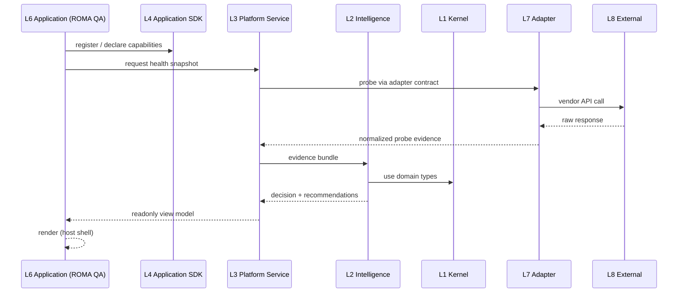

# ROMA OS Layer Model

**Program:** ROMA OS  
**Status:** Official layer definition  
**Date:** 2026-07-07  
**Version:** 1.0

Parent: [ROMA_OS_ARCHITECTURE.md](./ROMA_OS_ARCHITECTURE.md)

---

## 1. Eight-Layer Model

ROMA OS is organized into eight layers. Layers 1–6 are **platform-internal**. Layers 7–8 connect to the outside world.

```
┌──────────────────────────────────────────────────────────────────────────┐
│ L6  APPLICATIONS                                                          │
│     ROMA QA │ Security │ Release │ Architecture │ Performance │ …       │
└───────────────────────────────┬──────────────────────────────────────────┘
                                │
┌───────────────────────────────▼──────────────────────────────────────────┐
│ L5  APPLICATION REGISTRY                                                  │
│     Installed apps, versions, capabilities, routes, dependencies          │
└───────────────────────────────┬──────────────────────────────────────────┘
                                │
┌───────────────────────────────▼──────────────────────────────────────────┐
│ L4  APPLICATION SDK                                                       │
│     Lifecycle, registration, permissions, nav, evidence, health hooks     │
└───────────────────────────────┬──────────────────────────────────────────┘
                                │
┌───────────────────────────────▼──────────────────────────────────────────┐
│ L3  PLATFORM SERVICES                                                     │
│     Health │ Audit │ Release │ Evidence │ Capability │ Graph │ History  │
└───────────────────────────────┬──────────────────────────────────────────┘
                                │
┌───────────────────────────────▼──────────────────────────────────────────┐
│ L2  INTELLIGENCE                                                          │
│     Normalization │ Reasoning │ Risk │ Confidence │ Impact │ Recommend   │
└───────────────────────────────┬──────────────────────────────────────────┘
                                │
┌───────────────────────────────▼──────────────────────────────────────────┐
│ L1  KERNEL (@aistroyka/roma-kernel)                                       │
│     Domain model │ Contracts │ Ontology │ Evidence types │ Relationships  │
└───────────────────────────────┬──────────────────────────────────────────┘
                                │ adapter contracts only
┌───────────────────────────────▼──────────────────────────────────────────┐
│ L7  ADAPTERS                                                              │
│     Project │ Tool │ Evidence adapters                                    │
└───────────────────────────────┬──────────────────────────────────────────┘
                                │
┌───────────────────────────────▼──────────────────────────────────────────┐
│ L8  EXTERNAL SYSTEMS                                                      │
│     AISTROYKA repo │ GitHub │ Supabase │ Cloudflare │ OpenAI │ CI tools   │
└──────────────────────────────────────────────────────────────────────────┘
```

---

## 2. Layer 1 — Kernel

### Purpose

Canonical **domain foundation**. Every concept exists once. Zero runtime behavior.

### Package

`packages/roma-kernel/` → `@aistroyka/roma-kernel@0.1.0`

### Contains

| Domain | Examples |
|--------|----------|
| Shared primitives | `RomaSeverity`, `RomaConfidence`, `RomaHealthStatus` |
| Platform ontology | `RomaSubsystem`, `RomaPlatformCapability` |
| Evidence | `RomaEvidence`, `RomaSignal`, `RomaProbeEvidence` |
| Findings | `RomaFinding`, `RomaRecommendation` |
| Release / risk | `RomaReleaseDecision`, `RomaRiskLevel` |
| Graph | `RomaGraphNode`, `RomaGraphEdge` |
| Contracts | `RomaModuleContract`, `ROMA_KERNEL_VERSION` |

### Prohibited

UI, APIs, DB, execution, AI calls, vendor SDKs, React/Next.js, apps/web imports.

### Status

**Implemented** (foundation v1). See [docs/kernel/](../kernel/).

---

## 3. Layer 2 — Intelligence

### Purpose

Transform **normalized evidence** into **explainable decisions**. Pure reasoning — no side effects.

### Responsibilities

| Function | Input | Output |
|----------|-------|--------|
| Evidence normalization | Raw adapter payloads | `RomaEvidence`, `RomaEvidenceBundle` |
| Decision reasoning | Evidence + context | `RomaDecision`, `RomaDecisionReason[]` |
| Risk aggregation | Findings + dependencies | `RomaRiskLevel`, domain rollups |
| Recommendation generation | Decision + gaps | `RomaRecommendation[]` |
| Confidence calculation | Coverage + freshness | `RomaConfidence`, percent |
| Dependency evaluation | Change sets + graph | Impact paths, blind spots |
| Impact analysis | Affected subsystems | `RomaReleaseImpact`, area status |

### Prohibited

UI rendering, API routes, probe execution, auto-remediation, LLM without deterministic fallback.

### Repository mapping (transitional)

| Module | Intelligence role |
|--------|---------------------|
| `roma-engineering-intelligence.ts` | Release/confidence decision engine |
| `roma-change-intelligence.ts` | Change impact + risk analysis |
| `roma-quality-dashboard.service.ts` | Health aggregation (partial — belongs in L3) |

### Status

**Partial** — rules implemented; layer not extracted as package.

---

## 4. Layer 3 — Platform Services

### Purpose

Shared **read models and orchestration contracts** consumed by all applications.

### Service Catalog

| Service | Responsibility | Transitional module |
|---------|----------------|---------------------|
| **Health Service** | Probe catalog, component cards, domain rollups | `roma-live-probes.ts`, `roma-quality-dashboard.service.ts` |
| **Audit Service** | Safe readonly audit, snapshot semantics | `roma-safe-readonly-audit.ts` |
| **Release Service** | Readiness labels, release decision surfacing | via engineering intelligence |
| **Evidence Service** | Evidence bundles, redaction, provenance | `roma-run-history-redaction.ts` |
| **Capability Service** | Subsystem/capability metadata | `ROMA_PLATFORM_MODEL.md` (design) |
| **Graph Service** | Quality graph nodes/edges | `roma-quality-graph.ts` |
| **Registry Service** | App + adapter catalog reads | planned |
| **History Service** | Saved audit runs, temporal diff | `roma-run-history.service.ts` |

### Prohibited

Application-specific business rules, vendor SDK imports (must use L7).

### Status

**Partial** — monolithic in `platform-admin`; service boundaries documented, not extracted.

---

## 5. Layer 4 — Application SDK

### Purpose

Define **how applications plug into ROMA OS** without modifying Kernel.

### SDK Contract Areas

| Area | Contract |
|------|----------|
| **Identity** | `app_id`, `app_version`, `contract_version` |
| **Lifecycle** | proposed → registered → enabled → executed → reported → deprecated → retired |
| **Registration** | Manifest submission to Registry Service |
| **Permissions** | Required platform-owner scopes; host-enforced |
| **Capabilities** | Declared assurance capabilities (plan, collect, verdict, …) |
| **Navigation** | Shell nav section registration (route, label, icon, order) |
| **Evidence** | Evidence types emitted; ingest hooks |
| **Health** | Health contributions; probe declarations |
| **Dependencies** | Required services, other apps, adapter refs |

### Kernel anchor

`RomaModuleContract` in `@aistroyka/roma-kernel` — stability, ownership, kernel version pin.

### Status

**Design + contract stub**. No runtime SDK package yet.

---

## 6. Layer 5 — Application Registry

### Purpose

Canonical catalog of **installed and planned applications**.

### Registry Record Schema

```yaml
id: roma-qa
name: ROMA QA
version: "1.0.0"
owner: platform-engineering
stability: pilot
capabilities:
  - executive_dashboard
  - safe_audit
  - engineering_intelligence
  - quality_graph
  - test_catalog
  - change_intelligence
routes:
  - /platform-admin/testing
  - /platform-admin/testing/safe-audit
  - …
required_services:
  - health
  - audit
  - history
  - graph
required_evidence:
  - probe_evidence
  - audit_snapshot
required_permissions:
  - platform_owner
dependencies:
  - "@aistroyka/roma-kernel"
  - aistroyka-project-adapter
adapters:
  - supabase-probe
  - cloudflare-probe
  - health-api-probe
```

### Status

**Design**. Inventory exists in [ROMA_PLATFORM_INVENTORY.md](../platform/ROMA_PLATFORM_INVENTORY.md); app registry not implemented.

---

## 7. Layer 6 — Applications

### Purpose

Domain-specific **assurance applications** that reduce specific engineering risk classes.

### First Applications

| Application | Status | Notes |
|-------------|--------|-------|
| **ROMA QA** | **Implemented** (transitional) | Operations Center modules |
| **ROMA Security** | Planned | AuthZ, headers, finance denylist |
| **ROMA Release** | Planned | Release gates, env validation |
| **ROMA Architecture** | Planned | Drift, boundary, dependency audits |
| **ROMA Performance** | Planned | CWV, latency, load signals |
| **ROMA AI** | Planned | LIVE/FALLBACK, provider governance |
| **ROMA Mobile** | Planned | iOS/Android store + device smoke |
| **ROMA Compliance** | Planned | Policy, audit trail, retention |

Detail: [ROMA_OS_APPLICATION_MODEL.md](./ROMA_OS_APPLICATION_MODEL.md)

### Application Rules

1. Applications **never** modify Kernel
2. Applications **never** import vendor SDKs directly
3. Applications consume **Services** via contracts
4. Applications emit **evidence and findings** in kernel types
5. Applications register via **SDK** before production enablement

---

## 8. Layer 7 — Adapters

### Purpose

**Only layer** that may import vendor SDKs and project-specific code.

### Adapter Types

| Type | Role | Examples |
|------|------|----------|
| **Project Adapter** | Map product inventory to kernel-neutral facts | AISTROYKA |
| **Tool Adapter** | Map execution tools to evidence contracts | Playwright, Maestro, Appium |
| **Evidence Adapter** | Normalize raw outputs to `RomaEvidence` | trace zip → EV-TRACE |

### Adapter Catalog (planned)

| Adapter | External system |
|---------|-----------------|
| AISTROYKA Project Adapter | Monorepo, routes, RBAC, mobile |
| GitHub Adapter | Actions, commits, PRs |
| Supabase Adapter | Auth, DB, migrations |
| Cloudflare Adapter | Workers, deploy, buildStamp |
| OpenAI Adapter | LLM provider health |
| Playwright Adapter | Web E2E |
| Appium Adapter | Android instrumented |
| Maestro Adapter | Mobile flows |

### Current gap

`roma-live-probes.ts` performs direct health/API calls. **Adapter extraction** is required for vendor-neutral certification.

---

## 9. Layer 8 — External Systems

### Purpose

Production infrastructure, vendors, and repositories **outside** ROMA OS control.

### AISTROYKA External Systems (inventory)

| System | ROMA relevance |
|--------|----------------|
| Cloudflare Workers | Web runtime, admin host |
| Supabase (AISTROYKA project) | Auth, DB, RLS |
| GitHub | CI, PRs, branch protection |
| Apple ASC / TestFlight | iOS distribution |
| Google Play | Android distribution |
| OpenAI / AI providers | Copilot, vision |
| Stripe | Billing (owner diagnostics only) |

ROMA OS observes these through **adapters only**.

---

## 10. Layer Interaction Flow



---

## 11. Layer Maturity Matrix

| Layer | Design | Partial impl | Package | Certified |
|-------|--------|--------------|---------|-----------|
| L1 Kernel | ✅ | ✅ | ✅ `@aistroyka/roma-kernel` | ✅ foundation v1 |
| L2 Intelligence | ✅ | ✅ | ❌ | ❌ |
| L3 Services | ✅ | ✅ | ❌ | ❌ |
| L4 SDK | ✅ | stub | ❌ | ❌ |
| L5 Registry | ✅ | ❌ | ❌ | ❌ |
| L6 Applications | ✅ | QA only | ❌ | pilot |
| L7 Adapters | ✅ | ❌ | ❌ | ❌ |
| L8 External | ✅ | ✅ (prod) | N/A | N/A |

---

## Document Control

| Version | Date | Change |
|---------|------|--------|
| 1.0 | 2026-07-07 | Official eight-layer model |
