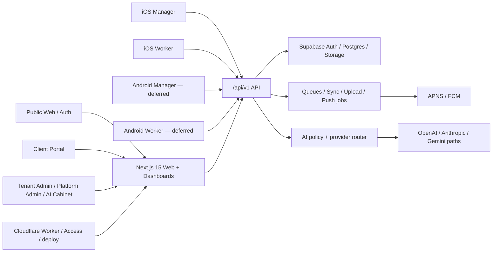

# AISTROYKA — полный аудит продукта, дизайна и архитектуры

> **Publish note (2026-08-09):** Previously local/unpublished historical context from the Phase 8 / Product Design program worktree (`release/phase8-ops-2026-08-02`, untracked). Included in the audit handoff so roadmap reconciliation links resolve on GitHub. Not a rewrite of the 2026-08-02 snapshot; absolute local Markdown links were converted to repo-relative paths for publishability. Distinct from **Product Design Remediation Slice 01** (2026-08-09 remediation track) and from already-implemented historical **Liquid Glass Slice 1** (public design foundation).

**Дата проверки:** 2 августа 2026  
**Проверенная рабочая копия:** `/Users/alex/Projects/AISTROYKA`  
**Ветка:** `release/phase8-ops-2026-08-02`  
**HEAD:** `b25dc97d01fff123655d2add204386549709e829`  
**Production build:** `8408ca26c3db1a88cd5166c9dc86458ec630bf4d`  
**Назначение:** сверить фактический функционал веб-приложения, backend/API, AI-кабинета, iOS и Android с планами и роудмапом; определить стадию дизайна, незакрытые функции, непроверенные контуры и реальные блокеры запуска.

---

## 1. Краткий вывод

Проект уже является большим работающим продуктом, а не прототипом. Основной веб-контур, backend/API, tenant dashboard, client portal, административные кабинеты, iOS Manager/Worker, синхронизация и большая часть AI-архитектуры реализованы. Текущие web, Cloudflare, iOS и Android сборки проходят.

Однако статус **«100% готово к первому реальному клиенту» пока подтверждать нельзя**.

Текущая честная стадия:

| Контур | Фактическая стадия | Итог |
|---|---|---|
| Backend/API | Pilot-ready по коду, тестам и основным live health-gates | Сильный, но не каждый из 313 маршрутов проверен live отдельно |
| Web-продукт | Pilot candidate | Основные multi-role flows закрыты; остаются legal, локализация, UI long tail и предупреждения сборки |
| Tenant/Admin/AI кабинеты | Функционально реализованы | Есть реальный E2E-пруф из Phase 3; live AI сегодня только `configured_unverified` |
| iOS Manager + Worker | Simulator-ready / pre-TestFlight | Обе сборки проходят; физическое устройство и TestFlight не закрыты |
| Android Manager + Worker | Buildable deferred foundation | Сборки проходят, но первый пилот официально без Android |
| Push | Контракты и провайдеры реализованы | Live APNS/FCM delivery не доказан в текущем прогоне |
| Billing/finance | Финансовые границы и основные flows реализованы | Live checkout/provider path сегодня не сертифицирован |
| Дизайн | **Wave C — feature migration in progress** | Фундамент един, но весь long tail ещё не приведён к одной системе |
| Operations | Phase 8 закрыта как release path, стабилизация продолжается | После P1-инцидента идёт новый 72-часовой период наблюдения |
| Первый клиент | Phase 9 — NO / не закрыта | Нет актуального полного Day‑0 evidence pack и финальных sign-offs |
| Финальная готовность | Phase 10 — не начата | Итоговый release verdict пока NO-GO |

Главный вывод: **архитектура и ядро продукта зрелые; незавершённость сосредоточена в release certification, реальных мобильных/live-provider проверках, legal/i18n и окончательной миграции дизайна.**

---

## 2. Что именно проверено

### Код и структура

- 118 web pages (`page.tsx`);
- 313 API handlers (`route.ts`);
- 154 web component files;
- 109 прямых route tests — 34,8% от количества API handlers, при этом часть общей защиты проверяется shared policy/contract tests;
- 49 tracked Playwright spec-файлов, из них 30 относятся к E2E/phase3-потокам;
- 92 Swift-файла и 6 iOS test-файлов;
- 35 Kotlin-файлов и 2 локальных Android unit-test файла;
- дорожные карты, phase closure документы, design-system backlog, release-hardening и pilot readiness документы.

### Фактически выполненные проверки 2 августа 2026

| Проверка | Результат | Комментарий |
|---|---|---|
| `check:design` | PASS | Сырьевые Tailwind-цвета не обнаружены |
| i18n key parity, включая all-locales mode | PASS | Проверяет наличие ключей, но не качество перевода и не hardcoded JSX |
| lint | PASS | Запускается в quiet-режиме и не показывает warnings |
| web unit/integration suite | **424 файла / 2737 тестов PASS** | Service role key намеренно исключён для безопасного локального прогона |
| Next.js production build | PASS | 424 static pages; 22 warnings в 20 файлах |
| Cloudflare/OpenNext build | PASS | Worker bundle создан; есть предупреждение об устаревшей compatibility date |
| iOS Manager simulator build | PASS | Debug, code signing disabled |
| iOS Worker simulator build | PASS | Debug, code signing disabled |
| Android shared tests + Manager/Worker Debug builds | PASS | 113 задач, 23 выполнены, 90 up-to-date; есть Gradle 9 deprecation warning |
| Production/staging health | PASS | `ok=true`, `db=ok`, release stamp есть, rate-limit RPC есть |
| Security headers smoke | PASS | apex/www, home/login/health/protected redirect |
| Public locales | PASS по HTTP | `/ru`, `/en`, `/es`, `/it` → 200 |
| Guest protection | PASS | `/ru/dashboard` и `/ru/portal` → локализованный login redirect |

### Ограничения аудита

- Полноценный визуальный просмотр через встроенный браузер был заблокирован административной политикой среды. Политику не обходили.
- Для визуальной оценки использованы production HTML, исходники, сохранённые скриншоты и прежние Playwright evidence. Сохранённые mobile design screenshots оказались специальным `DesignPreview`-стендом, а не полными реальными пользовательскими экранами; поэтому они не считаются доказательством готовности всех flows.
- Не выполнялись платные/live AI-запросы, реальные push-отправки, платежи, production mutations, TestFlight/Play upload и физические device-тесты.
- Аудит проводился на dirty release-ветке: она на 38 коммитов впереди и на 5 коммитов позади `origin/main`. Пользовательские изменения не изменялись. Поэтому отчёт фиксирует именно проверенное состояние этой ветки и текущего production, а не абстрактный `main`.

---

## 3. Архитектура продукта

### Сильные стороны архитектуры

1. **Один backend contract.** Web, iOS и Android используют `/api/v1`; lite Worker-клиенты ограничиваются отдельным allow-list.
2. **Tenant isolation и RBAC являются системными, а не экранными проверками.** Phase 2 закрыла негативные сценарии, active tenant selection, platform-owner gates, legacy bypass и customer-finance boundary.
3. **Finance safety встроена в API.** 28 финансовых маршрутов имеют доказанный guard-контракт; customer и manager поля разделены.
4. **AI отделён на service, policy и provider layers.** Есть provider router, governance/policy, очереди и честный degraded/fail-closed режим.
5. **Worker offline path не является UI-заглушкой.** Есть sync service, operation queue, upload manager, conflict reconciliation и idempotency.
6. **Release stamp и database/RPC health проверяются на runtime.** Это позволило обнаружить и восстановить production drift после Workers Builds incident.
7. **Дизайн-токены существуют на всех платформах.** Web CSS tokens, Swift `BrandTokens`, Kotlin `BrandTokens` используют одну визуальную основу.

### Архитектурные риски

1. **Очень большая поверхность одного web-приложения:** 118 страниц и 313 API handlers. Это повышает цену регрессии и требует route-matrix + role-matrix, а не только общего unit suite.
2. **Прямые route tests есть для 109 из 313 handlers.** Это не означает, что остальные не защищены, но individual handler coverage неоднородна.
3. **Операционный deploy path недавно допустил обход GitHub guards через Cloudflare Workers Builds.** Инцидент восстановлен, но 72h stabilization ещё идёт.
4. **AI, push и billing зависят от внешних провайдеров.** Компиляция и конфигурация не равны live-operational proof.
5. **Статусные документы накопили исторические verdicts.** В одном файле могут одновременно оставаться старый BLOCKED/FAIL и новый recovery verdict. Нужен один актуальный truth index.

---

## 4. Сверка с роудмапом 0–10

Основной актуальный план: `AISTROYKA_100_PERCENT_COMPLETION_PLAN.md` *(unavailable on canonical `main` / this publish pack — local/unpublished historical reference)*.

| Phase | План | Фактический статус | Что ещё открыто |
|---:|---|---|---|
| 0 | Baseline freeze | **YES** | Общая документация после этого снова начала расходиться по датам и verdicts |
| 1 | Dependencies/security/design P0 | **YES** | Design P0 gate зелёный, но это не означает завершение Wave C |
| 2 | Backend API/RBAC/finance isolation | **YES** | Миграции, бывшие внешним блокером, сейчас видны live; individual live-route sweep не выполнялся сегодня |
| 3 | Web product flows | **YES по closure evidence** | Multi-role E2E был закрыт 28 июля; сегодня authenticated browser rerun не выполнялся |
| 4 | Mobile backend contracts | **YES для contracts/loopback** | Реальная APNS/FCM доставка всё ещё без live evidence |
| 5 | iOS pilot readiness | **YES для simulator/Layer B** | Physical device smoke и TestFlight: `BLOCKED_EXTERNAL / NOT_AUTHORIZED`; Launch YES = NO |
| 6 | Android defer/readiness | **YES — DEFERRED** | Formal defer signature OPEN; emulator/device, live FCM и Play отсутствуют |
| 7 | AI reliability | **YES — DEGRADED** | Сейчас providers configured, но health сообщает `configured_unverified`, `aiLastVerifiedSuccessAt=null` |
| 8 | Ops/deploy/observability | **YES для release path; stabilization IN PROGRESS** | После P1 incident новый 72h clock до 5 августа 2026 12:35:15Z; Phase 9 пока NO |
| 9 | Pilot Day0 | **NO / не закрыта** | Актуальный client intake, tenant/project/accounts, devices, support и двусторонние sign-offs не доказаны единым свежим пакетом |
| 10 | Final 100 closure | **Не начата** | Нельзя начинать до Phase 9 YES и очистки stale claims |

### Расхождение старого и нового плана

Старый `DEVELOPMENT_ROADMAP.md` в основном уже выполнен:

- AIService и SyncService существуют;
- admin, billing и legacy routes реализованы/защищены;
- multi-provider AI и policy layer существуют;
- mobile sync/push/upload contracts существуют;
- dashboards/analytics существуют;
- cron/deploy/migrations/observability существуют.

Оставшиеся проблемы относятся не к отсутствию базовой архитектуры, а к **завершению пользовательского опыта и operational certification**.

---

## 5. Функциональность по приложениям и кабинетам

### 5.1 Public web и авторизация

**Работает:**

- RU/EN/ES/IT public routes доступны;
- login доступен;
- dashboard/portal защищены guest redirect;
- контакты имеют abuse controls;
- public AI demo честно маркируется как simulator/mock;
- security headers проходят.

**Не закончено / требует исправления:**

- На живой русской главной есть английский блок `Continue exploring`, английские описания карточек и CTA.
- Privacy и Terms содержат явный placeholder: «Заглушка — юридический текст» / `Placeholder — legal content`.
- AI demo визуально полезен, но не является доказательством live AI.
- Semantic translation quality не проверяется существующим i18n gate.

**Стадия:** функционально готово, контентно/legal — не готово к полноценному публичному запуску.

### 5.2 Tenant dashboard

**Реализовано:**

- проекты и project detail;
- задачи и task detail;
- daily reports, reports, media/uploads;
- approvals, change orders, defects, handover, discussions;
- team/workload/devices;
- portfolio, governance, analytics;
- AI insights/copilot surfaces;
- support и onboarding.

**Доказательство:** Phase 3B/3E multi-role E2E, большой unit/integration suite, текущая production build.

**Проблемы:**

- production build показывает React Hook dependency warnings на jobs, leads, push, uploads, reports, devices, support, tasks, AI hooks и platform admin;
- `lint --quiet` делает эти предупреждения невидимыми в обычном зелёном gate;
- часть экранов содержит hardcoded English или legacy design aliases;
- нет свежего полного real-screen visual regression прогона на всех ролях и размерах.

**Стадия:** pilot candidate, необходим polish/hardening sprint.

### 5.3 Client portal

**Реализовано и ранее E2E-доказано:** stakeholder access, project views, client-facing financial/approval surfaces, handover и scoped data access.

**Открыто:** повторный текущий production E2E с реальным stakeholder account не выполнялся; legal/content качество общее с public web.

**Стадия:** функционально готово для контролируемого пилота.

### 5.4 Tenant admin и Platform Admin

**Реализовано:** operator/system/jobs/leads/push/governance/trust, platform-owner console, access control, negative non-grant tests. `admin.aistroyka.ai` защищён Cloudflare Access.

**Открыто:**

- заметное количество hardcoded English в platform-admin и operator/support компонентах;
- React Hook warnings могут давать stale load/error состояния после изменения locale, pagination или filters;
- часть operational metrics имеет safe placeholder fallback, поэтому наличие UI не гарантирует полноту телеметрии.

**Стадия:** operationally usable, localization/design polish in progress.

### 5.5 AI кабинет и AI runtime

**Реализовано:**

- AI service и provider router;
- OpenAI, Anthropic и Gemini-related provider paths;
- vision/video analysis paths;
- policy/governance и rate limiting;
- admin AI requests, analytics, security и guide;
- tenant/project intelligence и Copilot SSE;
- fail-closed/degraded поведение.

**Текущее live состояние:**

- `aiConfigured=true`;
- `openaiConfigured=true`;
- vision providers: OpenAI + Anthropic;
- `aiOperationalStatus=configured_unverified`;
- `aiLastVerifiedSuccessAt=null`.

**Вывод:** AI нельзя маркировать как свежеподтверждённый LIVE. Правильная формулировка сейчас: **настроен, функциональный код присутствует, live-provider path требует сертификационного smoke**.

### 5.6 Finance и billing

**Реализовано:** estimates, change orders, client-facing guards, approvals и tenant isolation. Customer-finance route matrix закрыта.

**Billing:** Stripe/provider path существует и защищён feature flags/cohort/config gates; предусмотрены sandbox/stub режимы.

**Открыто:** сегодня не выполнялись реальный checkout, webhook и reconciliation. Если billing входит в первый пилот, нужен отдельный live-safe checklist.

### 5.7 Sync, media, uploads и push

**Реализовано:** upload sessions, background upload, offline operation queue, sync/conflict reconciliation, idempotency, devices registration, APNS/FCM providers, push outbox/jobs.

**Доказано:** Phase 4 loopback lifecycle 10/10, текущие unit tests, rate-limit RPC live.

**Не доказано live:** APNS delivery, FCM delivery, плохая сеть на физическом устройстве, background recovery после убийства приложения.

### 5.8 iOS Manager

**Реализовано:** login/auth, projects, dashboard, reports review, tasks, team, AI/Copilot, settings, onboarding, notifications navigation.

**Сегодня:** simulator build PASS.

**Открыто:** physical-device smoke, TestFlight archive/upload, crash reporting configuration, production client credentials/sign-off.

**Стадия:** основной мобильный pilot candidate, но ещё pre-TestFlight.

### 5.9 iOS Worker

**Реализовано:** login, home/project picker, shift lifecycle, task view, report create/resubmit, camera/media, upload queue, sync, diagnostics, device/push registration.

**Сегодня:** simulator build PASS.

**Открыто:** физическая камера, background upload, offline/online recovery и push на реальном iPhone; TestFlight.

**Стадия:** основной Worker pilot candidate, но ещё pre-device certification.

### 5.10 Android Manager и Worker

**Реализовано:** Compose foundation, auth, основные Manager/Worker flows, shared API/auth/session layer, FCM compile wiring.

**Сегодня:** shared tests и обе Debug-сборки PASS.

**Не реализовано/не доказано до паритета iOS:** полный набор вторичных экранов, offline-first parity, device/emulator E2E, live FCM, signed Play build/upload.

**Стадия:** buildable engineering foundation. Это соответствует официальному решению **YES — DEFERRED**, а не launch-ready Android.

### 5.11 Явно незавершённые функции

| Функция | Состояние |
|---|---|
| SCIM | Endpoint skeleton возвращает 501 `SCIM not implemented` |
| Privacy / Terms | Placeholder legal text |
| Live AI certification | Configured, но operationally unverified |
| Live APNS/FCM | Provider code есть, delivery proof нет |
| TestFlight / physical iOS | Не выполнено / не авторизовано |
| Google Play / Android pilot | Официально deferred |
| Full semantic localization | Key parity есть, качество и hardcoded text не закрыты |
| Full visual regression of real screens | Нет единого свежего cross-platform evidence pack |
| Phase 9 client Day0 | Не закрыта |
| Phase 10 final verdict | Не начата |

---

## 6. Аудит дизайна

Основные источники: [rollout waves](../design-system/04-rollout-waves.md), [Wave C backlog](../design-system/09-wave-c-feature-migration-backlog.md), [current drift note](../design/DESIGN_SYSTEM_DRIFT_2026.md).

### Реальная стадия дизайна

- Wave A — Web Foundation: **Complete**;
- Wave B — Mobile Foundation: **Complete**;
- Wave C — Feature Surface Migration: **In progress**.

Следовательно, проект нельзя считать полностью дизайн-завершённым, даже если `check:design` проходит.

### Что хорошо

1. Web/iOS/Android согласованы по тёмному фону, жёлтому accent, surfaces, text hierarchy и базовым radius/spacing.
2. Существуют общие semantic tokens и primitives.
3. Критические P0 operational statuses постепенно переведены на shared badge mappings.
4. Public shell и dashboard shell используют общий brand language.
5. Raw Tailwind colors gate проходит.
6. Есть accessibility/contrast и responsive Playwright specs в Phase 3 evidence.

### Что не закончено

1. **Legacy aliases остаются.** `--ai-yellow`, `--bg-card`, `--text-main`, `--text-muted`, `--bg-main` всё ещё используются в 5 web-файлах, включая shared cards/panels.
2. **`globals.css` дублирует deprecated aliases**, хотя canonical source уже `design-tokens.css`.
3. **Wave C long tail открыт:** dense project actions, admin secondary screens, workload, mobile edge/error/retry states.
4. **Локализация визуально ломает единый опыт.** На RU production есть английский блок; platform-admin/operator/support содержат hardcoded English.
5. **Текущий i18n gate недостаточен.** Heuristic сравнение с EN нашло 292 RU, 313 ES и 331 IT строк, идентичных английским. Часть — бренды и технические термины, но выборка подтверждает реальные непереведённые блоки.
6. **Design preview screenshots не равны product screenshots.** В них есть `Dashboard`, `KPI card`, `Row 1…4`, `preview:home`; это тест токенов и primitives.
7. **Large text требует доработки.** В iOS preview email на login переносится неудачно при крупном шрифте. Клиппинга нет, но композиция слабая.
8. **Нет свежей матрицы всех реальных экранов** для primary/loading/empty/error/permission-denied states на web, iOS и Android.
9. Два `` остаются без Next Image optimization.

### Дизайн-вердикт

**Фундамент дизайна готов; продукт находится примерно на стадии системной миграции feature surfaces, а не финального visual polish.** Критические user journeys можно пилотировать после закрытия legal/i18n и real-screen regression, но масштабный публичный launch сейчас преждевременен.

---

## 7. Что не работает или не доказано

Важно различать четыре состояния:

| Состояние | Примеры |
|---|---|
| Реально не реализовано | SCIM; финальный legal content |
| Реализовано, но не проверено live | AI provider request сегодня; APNS/FCM; Stripe checkout/webhook |
| Работает локально/на симуляторе, но не сертифицировано на устройстве | iOS Manager/Worker; Android apps |
| Работает, но UX не завершён | localization, legacy tokens, hardcoded English, React warnings |

### Текущие production-факты

- [Production health](https://aistroyka.ai/api/v1/health): `ok=true`, `db=ok`, release stamp present, RPC present.
- Apex, www и staging показывают один SHA `8408ca2`.
- [Русская главная](https://aistroyka.ai/ru) доступна, но содержит английский related-content блок.
- Guest protection работает.
- AI показывает `configured_unverified`, а не live verified.

---

## 8. Приоритетный backlog

### P0 — до первого реального клиентского запуска

| Работа | Почему блокирует | Критерий закрытия |
|---|---|---|
| Завершить Phase 8 stabilization | Недавний P1 deploy drift | 72h без повторного drift; все checkpoints PASS; один canonical incident verdict |
| Заменить Privacy/Terms placeholders | Публичный legal риск | Утверждённый текст на всех launch locales |
| Сформировать актуальный Phase 9 Day0 pack | Старый документ не доказывает текущего клиента | Client intake, tenant/project/accounts, roles, support, devices и sign-offs заполнены и проверены |
| iOS physical-device + TestFlight smoke | Simulator build недостаточен для пилота | Worker/Manager на реальных iPhone: auth, report/media, approval, offline recovery, push |
| Сертифицировать AI claim | UI/health не должен обещать LIVE без провайдера | Live smoke PASS и timestamp в health либо явный degraded label во всех relevant UI |
| Сертифицировать push, если он обязателен пилоту | Provider code не доказывает доставку | APNS на pilot iPhone; FCM только если Android возвращается в scope |

### P1 — polish и управляемость пилота

| Работа | Критерий закрытия |
|---|---|
| Убрать английский из RU/ES/IT и hardcoded JSX | Semantic translation audit + screenshot review; не только key parity |
| Закрыть 22 production-build warnings | Hooks корректно реагируют на locale/filter/page changes; build без warnings |
| Пройти Wave C P0/P1 real surfaces | Project detail, approvals, reports, portfolio, admin, workload и mobile critical flows |
| Создать visual regression matrix реальных экранов | Все роли × desktop/mobile × loading/empty/error/denied; preview harness отдельно |
| Проверить billing live-safe path, если входит в пилот | Test checkout, webhook signature, idempotency, reconciliation и rollback |
| Обновить compatibility/browser data и Gradle warnings | Cloudflare compatibility date актуальна; Gradle 9 blockers перечислены/устранены |
| Добавить mobile crash reporting | Configured in pilot builds, PII-safe, alert ownership documented |
| Консолидировать status docs | Один `CURRENT_PROJECT_TRUTH_INDEX` с датой, SHA, phase verdicts и superseded links |

### P2 — после первого пилота / по коммерческому требованию

- SCIM implementation, если Enterprise действительно обещает provisioning;
- Android device/Play readiness после явного owner/client mandate;
- удаление legacy CSS aliases и dead placeholder files;
- системный performance/Lighthouse budget для самых тяжёлых admin AI pages;
- замена `` на оптимизированный image path;
- замена fallback metrics на полностью доказанный observability source;
- очистка worktree/evidence hygiene после сохранения пользовательских изменений.

---

## 9. Рекомендуемая последовательность работ

### Шаг 1 — зафиксировать правду релиза

1. Не делать новый production feature deploy до завершения текущего 72h окна.
2. Свести Phase 8 incident/recovery в один непротиворечивый документ.
3. Обновить dashboard/status/truth index на SHA `8408ca2` и текущие verdicts.

### Шаг 2 — закрыть launch blockers контента и UX

1. Legal content.
2. RU/ES/IT semantic localization и hardcoded JSX.
3. 22 React/build warnings.
4. Wave C critical screens и actual-screen visual regression.

### Шаг 3 — сертифицировать реальные внешние контуры

1. Live AI smoke с корректным health timestamp.
2. APNS delivery.
3. iOS physical-device flows и TestFlight.
4. Billing smoke — только если в scope первого пилота.

### Шаг 4 — выполнить Phase 9

1. Актуальный client intake.
2. Tenant/project/users/roles.
3. Support process.
4. Device matrix.
5. Owner + client sign-off.

### Шаг 5 — Phase 10

1. Удалить/архивировать stale launch claims.
2. Опубликовать единственный GO/conditional GO/NO-GO verdict.
3. Зафиксировать deferred items: Android, SCIM, post-pilot UX.

---

## 10. Итоговый вердикт

### Что уже можно считать сделанным

- основная backend/API архитектура;
- tenant/RBAC/finance isolation;
- ключевые web multi-role flows;
- client portal и platform admin;
- iOS Manager/Worker функциональный контур;
- Android buildable foundation;
- sync/upload/offline backend contracts;
- AI architecture и degraded behavior;
- Cloudflare build/deploy/health architecture;
- базовая кроссплатформенная design system.

### Что нельзя считать завершённым

- финальный public/legal продукт;
- семантическая локализация всех кабинетов;
- полный Wave C дизайн;
- fresh live AI proof;
- live mobile push;
- physical iOS/TestFlight pilot certification;
- Android pilot/Play readiness;
- SCIM;
- Phase 9 client Day0;
- Phase 10 final 100% closure.

**Финальная оценка:** продукт находится на границе **Phase 8 stabilization → Phase 9 preparation**. Для контролируемого web+iOS пилота база близка к готовности, но общий запуск остаётся **NO-GO**, пока не закрыты stabilization, legal, реальные device/provider checks и клиентские sign-offs.

