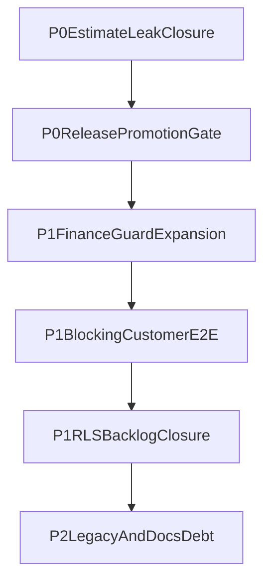

# Deep Audit Remediation Plan

Date: 2026-05-25  
Input: `docs/audit/DEEP_AUDIT_RISK_REGISTER.md`  
Goal: close critical/high risks and convert release posture from conditional to launch-ready.

Execution reference:

- `docs/audit/DEEP_AUDIT_EXECUTION_RUNBOOK.md` (live/operator closure flow)

## Current execution snapshot

- Completed in code/workflows and validated in live runs:
  - `/api/v1/projects/:id/estimate` now denies non-manager roles.
  - Stakeholder finance sanity script now checks `/estimate` deny path.
  - RLS hotfix migration drafted for `project_estimate_results` internal-only access.
  - Portal fail-closed finance guard expanded across progress/documents/decisions/estimates/change-orders/proof routes with dedicated route tests.
  - Production workflow now starts from successful staging workflow completion.
  - Staging pilot E2E switched from optional to blocking.
  - Production smoke health gate tightened to require `HTTP 200`.
  - Production run `26406727533` passed: deploy, pilot smoke, and stakeholder finance sanity.
  - Production fail-fast guard for missing `CRON_SECRET` is active and validated.
- Still pending:
  - Apply migrations and verify live RLS behavior for estimate-results boundary.
  - GitHub branch protection/ruleset confirmation in UI.
  - Remaining RLS advisory table closure and full Phase 13 doc reconciliation.
  - Supabase migration preflight secret rollout so migration env check runs in deploy workflows (currently skipped).

## Wave P0 (immediate, release-blocking)

Target window: 24-72 hours

1. Close internal estimate leakage for stakeholder/customer surfaces.
   - Lock down API auth for `GET /api/v1/projects/:id/estimate`.
   - Remove internal finance payload from any customer-accessible projection.
   - Add/adjust RLS for `project_estimate_results` to internal-only read unless explicit sanitized projection exists.
   - Files likely touched:
     - `apps/web/app/api/v1/projects/[id]/estimate/route.ts`
     - `apps/web/lib/domain/estimate/estimate.service.ts`
     - `apps/web/supabase/migrations/*` (new migration)

2. Enforce release promotion gate staging -> production.
   - Production deploy must depend on successful staging deploy + blocking smoke.
   - Introduce explicit promotion workflow (manual approval or `workflow_run` gate).

3. Confirm branch protection and required checks in GitHub UI.
   - Required at minimum: `CI Check`.
   - Record screenshot/log evidence in audit docs.

Acceptance criteria for P0:

- Stakeholder cannot retrieve internal estimate intelligence (API + DB + tests).
- Production cannot deploy from main without staged successful gate.
- Required checks enforcement confirmed by maintainers.

## Wave P1 (next release cycle)

Target window: 3-10 days

1. Expand fail-closed finance guard coverage for customer-facing endpoints.
   - Apply `assertCustomerFinanceSafePayload` or equivalent centralized projection guard to all portal/customer/share routes.
   - Add negative tests per route family.

2. Convert launch-relevant E2E from non-blocking to blocking for release path.
   - At minimum include customer-commercial chain subset:
     - estimate send
     - owner response
     - change-order customer-facing approval
     - proof-pack/share sanity

3. Harden webhook/cron runtime policy.
   - Require secrets in production, fail startup/check when missing.
   - Add explicit environment checks to release policy scripts.

4. Resolve RLS backlog for remaining advisory tables (11-table list from phase docs).
   - Add migration evidence and least-privilege policy definitions.

Acceptance criteria for P1:

- Finance guards and negative tests cover all customer route groups.
- Blocking E2E subset enforced in release path.
- Webhook/cron hardening cannot silently downgrade in production.
- RLS advisory issues are closed or explicitly risk-accepted.

## Wave P2 (planned debt and governance)

Target window: 2-6 weeks

1. Reduce API drift by deprecating/migrating legacy non-v1 routes.
2. Improve tenant selection ergonomics for multi-tenant users (explicit tenant switch context).
3. Stabilize Cloudflare build/deploy patch chain with simplification or upstream-compatible path.
4. Reconcile and normalize phase closure documentation for single source of truth.
5. Archive or remove non-canonical workflow files that can mislead operators.

Acceptance criteria for P2:

- Legacy API surface materially reduced with deprecation policy.
- Tenant context explicitness implemented and tested.
- Deploy path less dependent on fragile patch steps.
- Phase closure docs no longer conflict across files.

## Sequencing and dependencies

## Validation protocol per wave

For every wave completion:

1. `bun run lint`
2. `bun run test`
3. `bun run build`
4. `bun run cf:build`
5. targeted security checks:
   - stakeholder deny checks for cost/estimate/internal routes
   - portal/share payload forbid-list checks
6. release checks:
   - `bun run release:check`
   - smoke/e2e workflows with archived evidence links

## Ownership model

- Web app/API boundary fixes: Web team
- RLS migrations and DB policy hardening: DB/Platform
- Workflow gating and promotion: Release Engineering
- Final risk acceptance and closure docs: Product + Security + Release owners

## Definition of done for remediation plan

This plan is complete only when:

- All critical risks are closed.
- High risks are closed or explicitly accepted with expiry and compensating controls.
- Audit artifacts are updated with fresh evidence and clear YES/NO closure verdict.
