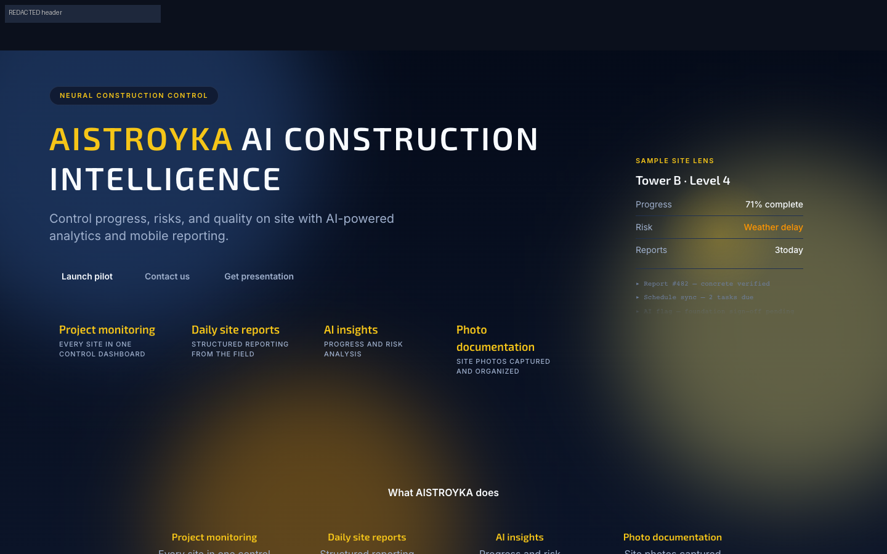
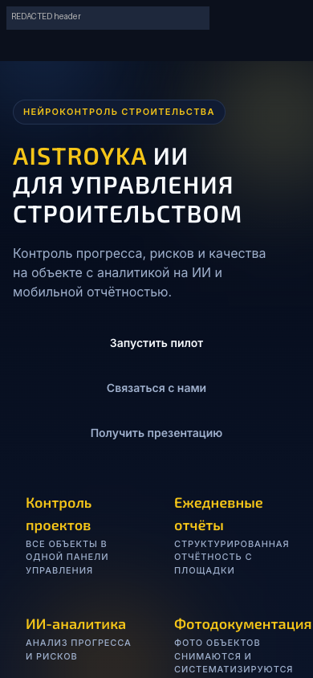
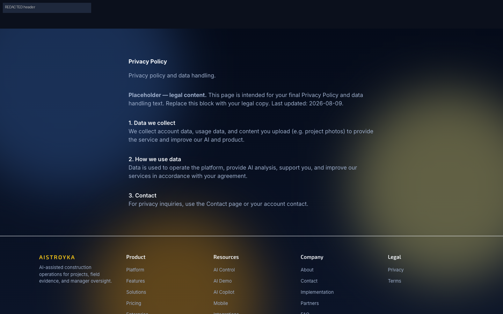
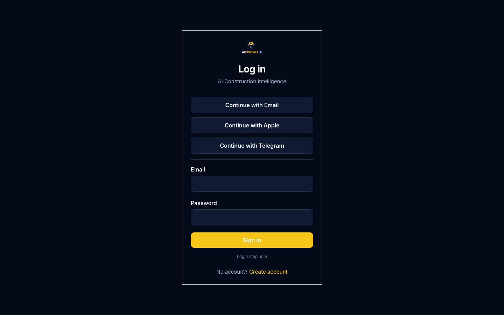
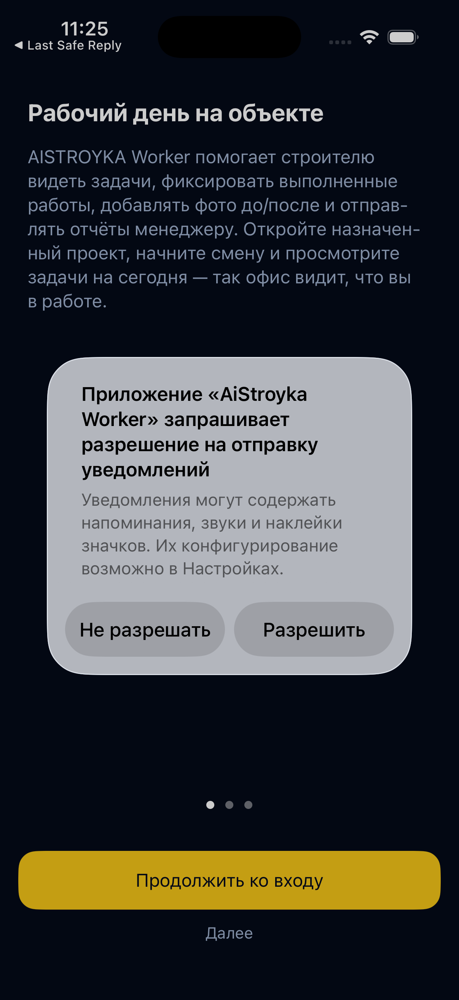

# 02 — Flow Step Audit (screenshot-backed)

**Runtime:** production + staging `02baa6a` · **Source:** `origin/main` `02baa6a379ca9ff30735d35e53aea5198e972d45`  
**Evidence root:** `evidence/` · **Manifest:** `evidence/manifest.json`  
**Publish note:** production public/auth + iOS onboarding screenshots are in git. Staging authenticated captures are **local-only** (`evidence/_local_unpublishable_staging/`, gitignored) because synthetic account identity pixels could not be fully scrubbed; narratives below still cite those capture IDs. See `08_PUBLISH_PRIVACY_NOTE.md`.

Health key: `HEALTHY` | `NEEDS_POLISH` | `PARTIAL` | `BLOCKED` | `BROKEN`

---

## A. Public discovery and authentication

| # | Step | Health | Screenshot | Notes |
|---|------|--------|------------|-------|
| A1 | Home EN desktop | HEALTHY |  | Strong brand hero, pilot CTAs, no fake numeric metrics. Sample Site Lens is clearly illustrative. |
| A2 | Home EN tablet/mobile | HEALTHY | `01_home_en_tablet.png`, `01_home_en_mobile.png` | Reflow works; brand remains dominant. |
| A3 | Home RU/ES/IT × viewports | HEALTHY | `01_home_{ru,es,it}_{mobile,tablet,desktop}.png` | Locales render; RU mobile CTA wording pilot-first. |
| A4 | Mobile header Cabinet | HEALTHY |  | **Кабинет** visible beside burger — not burger-only. |
| A5 | Features EN | HEALTHY | `04_features_en_desktop.png` | Capability catalog coherent with home. |
| A6 | Contact EN | HEALTHY | `05_contact_en_desktop.png` | Form present; submit not exercised. |
| A7 | Privacy EN (+ RU/ES/IT) | PARTIAL |  + `13_privacy_*` | Explicit **Placeholder — legal content** banner. Pilot legal gate open. |
| A8 | Terms EN | PARTIAL | `07_terms_en_desktop.png` | Same placeholder pattern. |
| A9 | Copilot mock | HEALTHY | `08_copilot_en_desktop.png` | Mock assistant; must remain labeled non-LIVE. |
| A10 | AI demo mock | HEALTHY | `09_ai_demo_en_desktop.png` | Mock analysis path. |
| A11 | 404 | NEEDS_POLISH | `10_404_en_desktop.png` | Functional but visually sparse vs marketing shell. |
| A12 | Login EN/RU/ES/IT desktop+mobile | NEEDS_POLISH |  + locale set | Works; **“Login step: idle”** debug string visible under Sign in. OAuth + email form coexist (Continue with Email + fields). |
| A13 | Register EN | HEALTHY | `03_register_en_desktop.png` | Account creation entry present. |
| A14 | Guest dashboard redirect | HEALTHY | `11_guest_dashboard_redirect_en_desktop.png` | Lands on localized login with `next=`. |
| A15 | Password reset | BLOCKED | — | **NOT_IMPLEMENTED** — no reset route on current main. |

**A11y sample (DOM):** home/login/privacy — `lang` correct; images have alt; unlabeled controls = 0; focus ring uses yellow box-shadow after Tab (visible). Not a WCAG certification.

---

## B. Tenant Manager cabinet (staging synthetic)

| # | Step | Health | Screenshot | Notes |
|---|------|--------|------------|-------|
| B1 | Login → dashboard | PARTIAL | local `evidence/_local_unpublishable_staging/cabinet/22_*.png` (+ `38_*`) | Staging build stamp `02baa6a`. **Welcome modal** overlays cockpit; dense onboarding (“0/5”, AI hints, AI Guide FAB) competes with ops. Not published in git (identity pixels). |
| B2 | Projects list | NEEDS_POLISH | `23_projects_en_desktop.png` | List works; modal previously intercepted Open clicks. |
| B3 | Project detail | PARTIAL | local `.../cabinet/36_project_detail_en_desktop.png` | Dual navigation: Overview/Reports/Documents/Schedule/Decisions **and** bottom Workers…Costs/Estimate. High density; next action unclear. Local-only evidence. |
| B4 | Tasks list | HEALTHY | `24_tasks_en_desktop.png` | Reachable from sidebar. |
| B5 | Reports | HEALTHY | `25_reports_en_desktop.png` | Reachable; review actions not deep-audited. |
| B6 | Approvals | HEALTHY | `26_approvals_en_desktop.png` | Inbox reachable. |
| B7 | Uploads | HEALTHY | `27_uploads_en_desktop.png` | Library reachable. |
| B8 | Support / notifications | HEALTHY | `29_*`, `30_*` | Reachable. |
| B9 | Decisions / CO entry | PARTIAL | `42_change_orders_entry_en_desktop.png` | Tab entry only; CO decide/approve not captured. |
| B10 | RU dashboard | HEALTHY | `34_dashboard_ru_desktop.png` | Locale switch works in cabinet. |
| B11 | Mobile dashboard | NEEDS_POLISH | `35_dashboard_en_mobile.png` | Usable; density + modal risk higher on small screens. |
| B12 | Task detail / chat | BLOCKED | — | No task deep-links in smoke workspace. |
| B13 | Approve/reject/change-request end-to-end | BLOCKED | — | Not safely exercised (no mutation authorization). |

---

## C. Client / stakeholder portal

| # | Step | Health | Screenshot | Notes |
|---|------|--------|------------|-------|
| C1 | Portal projects | PARTIAL | `31_portal_projects_en_desktop.png` | Route works under dashboard shell. |
| C2 | Client project view | PARTIAL | local `.../portal/39_client_portal_view_en_desktop.png` | Role text says Client; CTA **Create first task** is contractor-shaped; full ops sidebar still visible in this capture; content skeleton loading. Internal finance fields not observed in viewport — **not** a clearance. Local-only evidence. |
| C3 | Client CO decision / defects / handover | BLOCKED | — | Not reached. |
| C4 | Denied/expired portal | BLOCKED | — | No safe expired-token fixture. |

---

## D. Admin / platform admin

| # | Step | Health | Screenshot | Notes |
|---|------|--------|------------|-------|
| D1 | Tenant admin home | NEEDS_POLISH | `32_admin_en_desktop.png` | Reachable for smoke admin; dense ops English risk. |
| D2 | Admin AI | HEALTHY | `33_admin_ai_en_desktop.png` | Observability surface reachable. |
| D3 | Platform admin | BLOCKED | `37_platform_admin_en_desktop.png` | **Forbidden** — correct for non-owner. |
| D4 | Operations Center `/testing` | BLOCKED | `43_platform_admin_testing_en_desktop.png` | Forbidden; read-only ROMA UI not visually audited this run. |

---

## E. AI cabinet / AI states

| # | Step | Health | Screenshot | Notes |
|---|------|--------|------------|-------|
| E1 | Public mock AI | HEALTHY | `08_*`, `09_*` | Explicitly mock. |
| E2 | Dashboard AI list | PARTIAL | `28_dashboard_ai_en_desktop.png` | Incomplete-analysis empty/error copy visible; welcome modal overlays; runtime keys configured — **no LIVE claim proven** (no paid call). |
| E3 | Live analysis trigger | BLOCKED | — | Paid/live AI forbidden by audit. |

---

## F. iOS Worker

| # | Step | Health | Screenshot | Notes |
|---|------|--------|------------|-------|
| F1 | Onboarding launch | PARTIAL |  `45_*` | RU onboarding copy clear; **system notification permission** overlays first screen before login. |
| F2 | Login → task → photo → voice → submit | BLOCKED | — | No E2E credentials; no remote fixtures. |
| F3 | Offline/retry | BLOCKED | — | Code-backed only (`SyncService` / upload queue). |

---

## G. iOS Manager

| # | Step | Health | Screenshot | Notes |
|---|------|--------|------------|-------|
| G1 | All Manager UI | BLOCKED | — | `AiStroykaManager.app` only on unavailable Shutdown simulator; did not boot/reconfigure devices owned by other work. Code inventory: `ManagerTabShell` Home/Projects/Tasks/Reports/Team/AI/More. |

---

## Cross-cutting strengths

1. Public Liquid Glass marketing shell is cohesive and brand-first across EN/RU/ES/IT.
2. Guest protection and header Cabinet CTA meet product rules.
3. Staging cabinet proves real multi-module IA with build stamp matching production SHA.
4. Public AI demos are labeled mock — honest vs LIVE.
5. Focus rings on public pages are visible in keyboard sample.

## Cross-cutting friction

1. Legal placeholders still public.
2. Login debug status string.
3. First-run modal + stacked onboarding widgets block/obscure pilot ops.
4. Project detail dual tab systems + Costs/Estimate adjacency increases wrong-path risk.
5. Client portal capture still feels like contractor cabinet.
6. Design governance: `check:design` fails on `TaskChatPanel` `red-600`.
