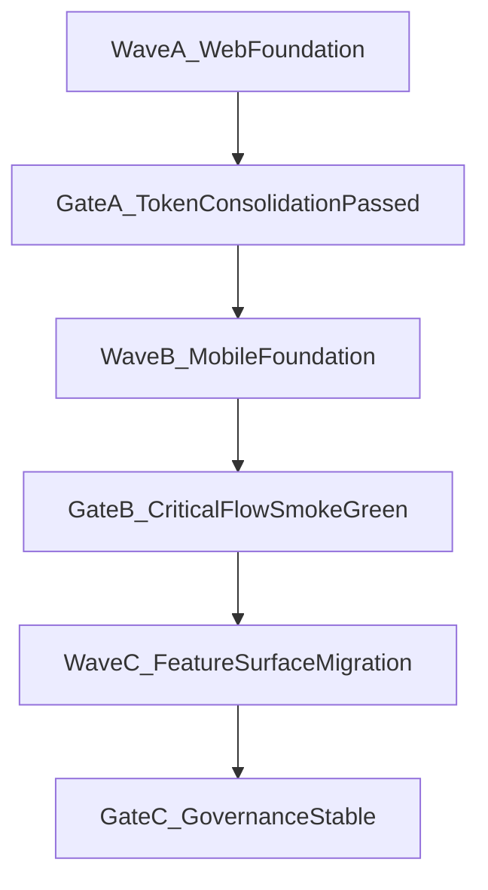

# Unified Design Rollout Waves (Web -> Mobile -> Features)

## Goal
Roll out the brand-first design system without breaking auth, tenant-aware logic, or dashboard operational flows.

## Status Snapshot (2026-04-08)
- Wave A — Web Foundation: Complete
- Wave B — Mobile Foundation: Complete
- Wave C — Feature Surface Migration: In progress
  - Web P0: Project operational surfaces + approvals/reports + portfolio command/control status harmonization in progress
  - Web P1: Tasks, AI requests, workload status harmonization started

## Wave A — Web Foundation

### Scope
- Consolidate token source in:
  - `/Users/alex/Projects/AISTROYKA/apps/web/app/design-tokens.css`
  - `/Users/alex/Projects/AISTROYKA/apps/web/app/globals.css`
- Normalize shared component usage in:
  - `/Users/alex/Projects/AISTROYKA/apps/web/components/ui`
  - `/Users/alex/Projects/AISTROYKA/apps/web/lib/ui-tokens.ts`
- Align public and dashboard shells to one semantic vocabulary:
  - `/Users/alex/Projects/AISTROYKA/apps/web/components/public/PublicHeader.tsx`
  - `/Users/alex/Projects/AISTROYKA/apps/web/components/DashboardShell.tsx`

### Exit Criteria
- No new legacy token usage in touched web files.
- Shared UI components consistently consume canonical tokens.
- Public and dashboard visual language is semantically aligned.

## Wave B — Mobile Foundation

### Scope
- iOS:
  - Introduce token-backed theme structures in Manager and Worker apps.
  - Refactor key primitives in `/ios/AiStroykaManager/.../Design` and Worker foundational views.
- Android:
  - Introduce branded Compose theme adapters (`Color/Type/Shape/Theme`) and resource token files.
  - Migrate core screens in both `ManagerApp.kt` and `WorkerApp.kt` to token-driven spacing/radius/colors.

### Exit Criteria
- Both mobile apps use approved token adapters for core UI.
- Manager and Worker share common primitive behavior patterns.
- No screen-level regressions in login/home/report critical flows.

## Wave C — Feature Surface Migration

### Scope
- Web: high-impact dashboard/public screens by business priority.
- Mobile: remaining feature screens in Manager and Worker apps.
- All migrated surfaces map back to Figma library components and token contract.

### Exit Criteria
- Prioritized surfaces migrated with visual consistency.
- Feature teams can deliver new UI without introducing ad-hoc styles.

## Recommended Sequencing and Gates

## Risk Controls per Wave
- Wave A:
  - Avoid route/auth logic edits while touching layout styles.
  - Verify locale-aware navigation remains unchanged.
- Wave B:
  - Keep behavior and API wiring untouched while migrating visual primitives.
  - Validate pilot automation selectors where present.
- Wave C:
  - Migrate by domain slices, not entire-app big-bang changes.
  - Apply visual regression checks on each slice before merge.

## Delivery Ownership
- Design system owner: approves token and component contracts.
- Web owner: wave A and web part of wave C.
- Mobile owners (iOS/Android): wave B and mobile part of wave C.
- QA owner: release gate evidence for visual/a11y/i18n checks.
