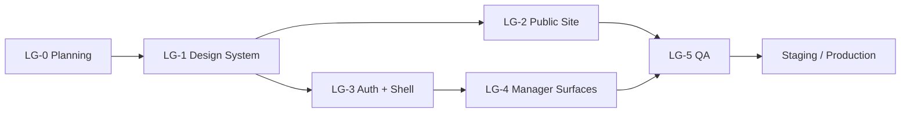

# LIQUID_GLASS_REDESIGN_ROADMAP — Phased Implementation

**Phase:** LG-0  
**Date:** 2026-06-18  
**Prerequisite docs:** `LIQUID_GLASS_UI_INVENTORY.md`, `LIQUID_GLASS_REDESIGN_AUDIT.md`, `AISTROYKA_LIQUID_GLASS_DIRECTION.md`, `LIQUID_GLASS_DESIGN_SYSTEM_PLAN.md`

---

## Phase overview

| Phase | Name | Duration estimate | Risk |
|-------|------|-------------------|------|
| **LG-0** | Planning & audit | Complete | — |
| **LG-1** | Design system foundation | 2–4 days | Medium |
| **LG-2** | Public website redesign | 4–7 days | Medium |
| **LG-3** | Auth + dashboard shell | 3–5 days | High |
| **LG-4** | Manager critical surfaces | 5–8 days | High |
| **LG-5** | QA, a11y, perf, fallback | 3–4 days | Medium |

---

## PHASE LG-1 — Design system foundation

### Goal

Canonical Liquid Glass primitives, tokens, and fallbacks — **no broad page redesign**.

### Build

- [ ] Add `--lg-*` tokens to `app/design-tokens.css`
- [ ] Canonicalize `styles/liquid-glass.css`
- [ ] Create `lib/design/liquid-glass.ts`
- [ ] Create `components/design/LiquidGlass.tsx`, `LiquidGlassFilter.tsx`, `GlassSurface.tsx`, `GlassIntensityControl.tsx`, `PublicAmbientField.tsx`
- [ ] Relocate/consolidate exploratory spike from `components/public/liquid-glass/`
- [ ] Add `prefers-reduced-transparency` + reduced-motion SVG seed disable
- [ ] Export from `components/design/index.ts`
- [ ] Storybook or static `/smoke` glass preview page (optional, uses existing `smoke/page.tsx`)

### Files likely touched

```
apps/web/app/design-tokens.css
apps/web/app/globals.css
apps/web/styles/liquid-glass.css
apps/web/lib/design/liquid-glass.ts
apps/web/lib/design/index.ts
apps/web/components/design/*
apps/web/components/public/index.ts  (re-exports only)
```

### Do NOT touch

- API routes, middleware auth logic
- Supabase migrations
- `DashboardShell` behavior (LG-3)
- Mobile iOS/Android
- Cloudflare wrangler secrets
- Business logic in `lib/features/*`

### Validation commands

```bash
cd apps/web
bun run check:design
bun run lint          # if toolchain available
bun run test          # unit tests must pass
bun run i18n:check    # if new strings added
bun run build         # from repo root after contracts
```

### Acceptance criteria

- [ ] `LiquidGlass` renders 4 layers with all variants
- [ ] Filter mounts once; no duplicate `#lg-refraction` IDs
- [ ] Safari/Firefox show blur fallback without console errors
- [ ] `prefers-reduced-motion` disables float/sweep/spring
- [ ] `prefers-reduced-transparency` shows opaque fallback
- [ ] Spike paths deprecated with re-export or removed
- [ ] No changes to dashboard page content

### Rollback

- Revert `components/design/*` and token additions
- Remove `liquid-glass.css` import from `globals.css`
- Restore spike-free public layout if partially integrated

---

## PHASE LG-2 — Public website redesign

### Goal

Apply Liquid Glass to marketing surfaces per `AISTROYKA_LIQUID_GLASS_DIRECTION.md`.

### Build order

1. `(public)/layout.tsx` — ambient field, filter, intensity control
2. `PublicHeader` → `GlassNav`
3. `PublicHomeContent` — hero lens, cards, CTA (glass budget enforced)
4. `/mobile` — device mock + store CTAs (text only, no official badges)
5. `/copilot`, `/ai-construction-control` — AI story pages
6. `/platform` — hub page
7. Shared `PublicPageHero` + `PublicSection` templates
8. Roll template to `/features`, `/solutions`, `/enterprise`, `/integrations`
9. Light polish: `/faq`, `/contact`, `/pricing` (CTA glass only)
10. `PublicFooter` — minimal; no glass or single link capsule

### Files likely touched

```
apps/web/app/[locale]/(public)/layout.tsx
apps/web/app/[locale]/(public)/PublicHomeContent.tsx
apps/web/app/[locale]/(public)/**/page.tsx
apps/web/components/public/PublicHeader.tsx
apps/web/components/public/PublicFooter.tsx
apps/web/components/public/PublicPageHero.tsx  (new)
apps/web/messages/{en,ru,es,it}.json
```

### Do NOT touch

- Dashboard routes
- Auth logic
- `CopilotChatPanel` production component
- Legal content meaning (privacy/terms text)

### Validation commands

```bash
bun run i18n:check
bun run --cwd apps/web e2e:pilot   # if env configured
bun run cf:build                   # before production claim
bash scripts/smoke/security_headers.sh
```

### Acceptance criteria

- [ ] Home hero has one signature glass lens + ≤6 glass nodes viewport
- [ ] All public CTAs retain `data-testid` where present
- [ ] en/ru/es/it strings updated together
- [ ] Long text sections remain on solid/transparent field without glass
- [ ] Lighthouse performance regression < 10% on home (LG-5 formal measure)
- [ ] No mock App Store badge assets added

### Rollback

- Feature flag CSS class `public-liquid` on layout — remove class to restore flat theme
- Keep LG-1 components; revert page-level usage only

---

## PHASE LG-3 — Auth pages + dashboard shell

### Goal

Premium entry (auth) and operational shell polish without glassifying data.

### Build

1. `(auth)/layout.tsx` — shared ambient field (subtle)
2. Login/register — single `GlassSurface` card
3. `DashboardShell` — **top bar only** optional soft glass; sidebar stays solid
4. Modal shells (`components/ui/Modal.tsx`) — optional prominent glass backdrop panel
5. Intensity preference: inherit from localStorage (optional, off by default in dashboard)

### Files likely touched

```
apps/web/app/[locale]/(auth)/layout.tsx
apps/web/app/[locale]/(auth)/login/page.tsx
apps/web/app/[locale]/(auth)/register/page.tsx
apps/web/components/DashboardShell.tsx
apps/web/components/ui/Modal.tsx
```

### Do NOT touch

- Sidebar link structure / RBAC
- Onboarding gate logic
- API auth routes
- `middleware.ts` tenant gates

### Validation commands

```bash
bun run test
bun run --cwd apps/web e2e:pilot
# Manual: login flow all locales
```

### Acceptance criteria

- [ ] Login/register functional; focus order preserved
- [ ] Dashboard tables visually identical (solid backgrounds)
- [ ] Sidebar navigation unchanged in behavior
- [ ] Mobile sidebar drawer works with glass top bar
- [ ] No glass on `CopilotChatPanel` transcript area

### Rollback

- Auth: remove glass wrapper, restore solid card
- Dashboard: revert top bar to `bg-aistroyka-surface` strip

---

## PHASE LG-4 — Manager critical surfaces

### Goal

Targeted polish on high-visibility manager flows — **accent only**, not full glass UI.

### Priority surfaces

1. `/dashboard` overview — stat cards stay solid; optional glass on “priority actions” banner
2. `/dashboard/projects/[id]` — project header strip soft glass
3. Intelligence panels — solid cards; gold accent border only
4. `/dashboard/ai` — marketing-style header; list solid
5. `/dashboard/approvals` — **NO glass** on queue (audit class C)
6. `/mobile` parity check (web only)

### Files likely touched

```
apps/web/app/[locale]/(dashboard)/dashboard/page.tsx
apps/web/app/[locale]/(dashboard)/dashboard/projects/[id]/page.tsx
apps/web/components/intelligence/*.tsx  (minimal)
apps/web/components/onboarding/*.tsx     (light)
```

### Do NOT touch

- Client routes `.../client/*` without product sign-off (class D)
- Owner console
- Admin tables
- Report table sorting/filtering logic
- Budget/cost internals (if surfaced later)

### Validation commands

```bash
bun run test:manager-layer
bun run audit:pilot
```

### Acceptance criteria

- [ ] Manager workflows complete without UI regression
- [ ] Zero displacement filters on pages with tables
- [ ] Customer-finance isolation unchanged (manual audit checklist)
- [ ] Intelligence readability spot-check with PM user

### Rollback

- Per-component revert; dashboard shell from LG-3 remains

---

## PHASE LG-5 — QA, accessibility, browser fallback, performance

### Goal

Ship-quality verification before production promotion.

### Work

- [ ] Cross-browser visual matrix (Chrome, Safari, Firefox)
- [ ] Contrast audit: nav, hero, CTA, auth card
- [ ] `prefers-reduced-motion` / `prefers-reduced-transparency` manual tests
- [ ] Glass node count audit on all redesigned routes
- [ ] Performance: Lighthouse home + dashboard overview
- [ ] `cf:build` + staging deploy smoke
- [ ] Pilot E2E if secrets available
- [ ] Document known limitations in `docs/design/LIQUID_GLASS_KNOWN_LIMITATIONS.md`

### Validation commands

```bash
bun run cf:build
bun run i18n:check
bun run lint
bun run test
bun run audit:pilot
bun run --cwd apps/web e2e:pilot
bash scripts/smoke/security_headers.sh
```

### Acceptance criteria

- [ ] All CI checks green
- [ ] No P0 accessibility failures on redesigned surfaces
- [ ] Safari acceptable degradation documented
- [ ] Performance budget documented (≤6 glass nodes, mobile no displacement)
- [ ] Stakeholder sign-off on client surfaces (if LG-4 touched portal)

### Rollback

- Tag pre-LG release commit
- Cloudflare promote previous Worker version (per runbook)

---

## Non-negotiable implementation rules

1. **Do not redesign backend** — no API contract changes for UI phases.
2. **Do not change API contracts** — request/response shapes frozen.
3. **Do not touch migrations** — zero Supabase schema changes for glass UI.
4. **Do not commit secrets** — no `.env` values in repo.
5. **Do not blindly apply glass everywhere** — enforce layer hierarchy and 6-node budget.
6. **Do not reduce readability** — WCAG AA on glass text; solid layers for dense data.
7. **Do not animate dense dashboard data** — no row hover sweeps, no table glass.
8. **Do not break existing tests/build** — CI must pass before merge.
9. **Do not remove product functionality** — visual-only changes.
10. **Do not change business logic** — no alterations to approvals, billing, AI pipelines.
11. **Do not modify Android/iOS runtime** in LG-1–LG-5 web phases.
12. **Use existing brand assets** — `Logo`, helmet SVG, `#F5C518` accent.
13. **Keep AISTROYKA serious** — construction operational cockpit, not crypto toy.
14. **Customer finance isolation** — never glass over or aestheticize internal contractor financial state on customer/owner surfaces (mega-roadmap).
15. **Preserve test IDs** — `data-testid="cta.public.*"` and pilot selectors.
16. **i18n parity** — en/ru/es/it for all new user-visible strings.
17. **No official App Store / Play badge reproduction** — text platform names only.
18. **Consolidate spike before expanding** — LG-1 before LG-2 page rollout.

---

## Suggested PHASE LG-1 prompt (next session)

```
PHASE LG-1 — Liquid Glass design system foundation for AISTROYKA.

Read:
- docs/design/LIQUID_GLASS_DESIGN_SYSTEM_PLAN.md
- docs/design/AISTROYKA_LIQUID_GLASS_DIRECTION.md
- ~/.cursor/skills/liquid-glass-app-site/reference/02-css-implementation.md

Tasks:
1. Consolidate exploratory spike into components/design/ per plan.
2. Add --lg-* tokens to design-tokens.css.
3. Implement LiquidGlass, LiquidGlassFilter, GlassSurface, GlassIntensityControl.
4. Add accessibility fallbacks (reduced motion, reduced transparency).
5. Do NOT redesign marketing pages yet — only primitives + optional /smoke preview.
6. Run check:design, test, i18n:check if strings added.

Non-negotiable: no backend/API/migration/auth/mobile changes.
```

---

## Dependency graph



---

## Risk register (roadmap-level)

| ID | Risk | Phase | Mitigation |
|----|------|-------|------------|
| R1 | Spike/architecture drift | LG-1 | Mandatory consolidation |
| R2 | Dashboard perf regression | LG-3/LG-4 | No displacement in app shell |
| R3 | Client surface finance leak aesthetic | LG-4 | Product review gate |
| R4 | Safari visual gap | LG-5 | Document acceptable frosted fallback |
| R5 | E2E breakage | LG-2 | Preserve testids |
| R6 | i18n drift | LG-2+ | `i18n:check` in CI |
| R7 | OpenNext SVG filter | LG-5 | `cf:build` gate |
