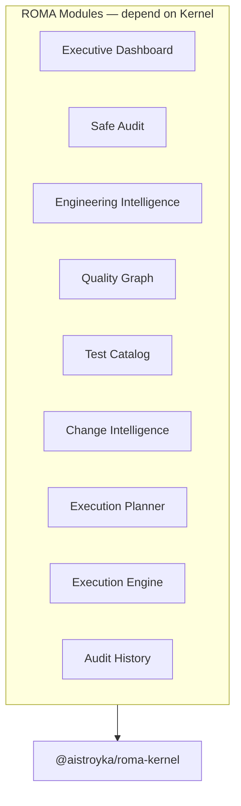

# ROMA Kernel Architecture

**Package:** `@aistroyka/roma-kernel`  
**Version:** 1  
**Branch:** `security/platform-admin-separation`  
**Status:** Foundation introduced — staged module adoption

---

## Why the Kernel Exists

ROMA grew as multiple modules (`roma-quality-dashboard`, `roma-engineering-intelligence`, `roma-change-intelligence`, etc.) each defining overlapping types: severity, confidence, risk, release, health, evidence, findings.

The **Kernel** is the canonical domain foundation:

- One definition per concept
- Zero business logic, UI, networking, persistence, execution
- All ROMA modules **depend on Kernel**; Kernel depends on **nothing** in ROMA or the web app

---

## What Belongs Inside Kernel

| In Kernel | Examples |
|-----------|----------|
| Canonical types | `RomaSeverity`, `RomaConfidence`, `RomaRiskLevel` |
| Platform ontology | `RomaSubsystem`, `RomaPlatformCapability` |
| Evidence model | `RomaEvidence`, `RomaSignal` |
| Findings / recommendations | `RomaFinding`, `RomaRecommendation` |
| Release / decision | `RomaReleaseDecision`, `RomaDecision` |
| Graph ontology | `RomaGraphNode`, `RomaGraphEdge` |
| Module contracts | `RomaModuleContract`, `ROMA_KERNEL_VERSION` |

---

## What Must NEVER Enter Kernel

| Forbidden | Reason |
|-----------|--------|
| UI components | Presentation layer |
| API routes / fetch | Networking |
| Supabase / DB types | Persistence |
| Probe runners | Implementation |
| Execution engine logic | Policy runtime |
| Dashboard assembly | Business logic |
| React / Next.js imports | Platform coupling |

---

## Package Structure

```
packages/roma-kernel/src/
  shared/          ids, severity, status, ownership, stability
  platform/        subsystem, capability, ontology
  health/          probe evidence, component health snapshots
  evidence/        evidence bundles, signals
  findings/        findings
  recommendations/ recommendations
  release/         release decision, readiness, impact
  risk/            risk levels
  dependency/      dependency graph metadata
  decision/        confidence, decision reasons
  capability/      capability kinds
  audit/           audit snapshot metadata
  change/          change set metadata
  test/            test domains, priorities
  graph/           quality graph ontology
  contracts/       module contracts, kernel version
  index.ts         public exports
```

---

## Dependency Direction



**Kernel imports nothing from consumers.**

---

## Build Integration

- Workspace: `packages/roma-kernel`
- Root build: `bun run build:roma-kernel` before web build
- Web resolution: `@aistroyka/roma-kernel` via tsconfig paths (source) and package dependency (dist)

---

## Related Documents

- [ROMA_KERNEL_DOMAIN_MODEL.md](./ROMA_KERNEL_DOMAIN_MODEL.md)
- [ROMA_KERNEL_DEPENDENCY_RULES.md](./ROMA_KERNEL_DEPENDENCY_RULES.md)
- [ROMA_KERNEL_ADOPTION_PLAN.md](./ROMA_KERNEL_ADOPTION_PLAN.md)
- [ROMA_KERNEL_CERTIFICATION.md](./ROMA_KERNEL_CERTIFICATION.md)
