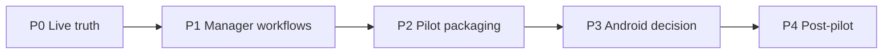

# AISTROYKA Pilot Readiness Roadmap

**Version:** 2026-07-01  
**Status:** Active — **current phase: P0**  
**Purpose:** Priority-based pilot readiness program. No broad feature expansion. No redesign. Android product work deferred until P3 decision.

---

## Non-negotiable rule

Do **not** move to a lower-priority phase while the current phase has meaningful unfinished work.

Every phase ends with:

1. validation  
2. post-audit  
3. YES/NO closure verdict  
4. exact blockers if not closed  

---

## Authoritative current state (2026-07-01)

| Area | Status |
|------|--------|
| Web/API core | Real — production `aistroyka.ai` health OK, `buildStamp.sha7=7f1b42f` |
| iOS Worker/Manager | Strongest mobile product contour; TestFlight build `2026063001` ASC VALID |
| Android | Buildable shell/foundation only — **must not block pilot** |
| Release/process truth | Highest priority (P0) |
| Budget/Cost (Step 13) | Migration applied; live GET/POST/PATCH verified staging + production |
| Documents/Acts/Contracts | Backend-capable; manager UI workflow not fully closed (P1) |
| Approvals | Exist; queue/resubmit needs closure (P1) |
| AI/Intelligence | Stabilize, do not expand broadly |
| Physical device smoke | `DEVICE_SMOKE_PARTIAL` — distribution ready, on-device checklist incomplete |

---

## P0 — Production / release / live truth

**Objective:** Prove the current core can be safely deployed, verified, and used for a pilot.

**Entry criteria:** None (start here).

**Tasks:**

| ID | Task | Evidence artifact |
|----|------|-------------------|
| P0.1 | Production deploy truth | `P0_PRODUCTION_DEPLOY_TRUTH.md` |
| P0.2 | Env/config gate | `P0_ENV_CONFIG_GATE.md`, `scripts/release/check-env-config.sh` |
| P0.3 | Pilot smoke live | `P0_PILOT_SMOKE_REPORT.md`, `scripts/smoke/pilot_launch.sh` |
| P0.4 | Step 13 Budget/Cost live | `P0_STEP13_COST_LIVE_VERIFICATION.md` |
| P0.5 | Pilot E2E path | `P0_PILOT_E2E_VERIFICATION.md` |
| P0.6 | Validation + GO/NO-GO | `P0_VALIDATION_REPORT.md`, `P0_POST_AUDIT.md`, `P0_GO_NO_GO.md` |

**Exit criteria:**

- Deployed SHA matches `origin/main` with live proof  
- Env gate script passes in CI modes (or blockers documented)  
- Pilot smoke passes critical paths (health, config, tenant metrics)  
- Step 13 cost layer live on target Supabase + runtime  
- Pilot-critical backend chain verified or gaps documented  
- P0 post-audit verdict issued  

**Risks:** CRON_SECRET not in local env (cron-tick 403 is expected on production); Playwright E2E creds missing locally; physical device smoke requires owner-connected devices.

**GO rule:** P0 closed YES only when all six areas are FULL or acceptable PARTIAL with no P0 blockers.

---

## P1 — Manager-usable product workflow closure

**Objective:** Documents + approvals + manager queue usable end-to-end.

**Entry criteria:** P0 closed YES or accepted with zero P0 blockers.

**Tasks:** See `PILOT_BACKLOG_PRIORITIZED.md` (P1.1–P1.6).

**Exit criteria:** create → upload → link → review → approve/reject/resubmit flows closed with tests and post-audit.

**Risks:** Scope creep into ECM/DMS; fake integrations.

---

## P2 — Pilot packaging and role validation

**Objective:** One coherent pilot scenario for first real client.

**Entry criteria:** P1 closed YES.

**Tasks:** Pilot dataset, role smoke (owner/admin/manager/worker/client), client/owner view polish, onboarding, runbook.

**Exit criteria:** Role matrix PASS; pilot runbook approved; client-facing surfaces verified without internal finance leak.

---

## P3 — Android Worker MVP or official defer

**Objective:** Explicit decision — do not let Android block web/iOS pilot.

| Option | Action |
|--------|--------|
| **A (recommended)** | Officially defer Android until after pilot unless client requires it |
| B | Minimal Worker MVP: login → report → photos → submit → sync |

**Entry criteria:** P2 packaging ready or parallel owner decision.

---

## P4 — Post-pilot scaling

Marketplace, BIM, ERP, billing cutover, broad Android parity, new AI dashboard, mass marketing — **out of scope** until P0–P2 closed.

---

## Phase sequence

---

## Current recommended phase

**P0** — in progress. Do not start P1 until P0 post-audit closure or explicit owner acceptance of remaining P0 blockers.
