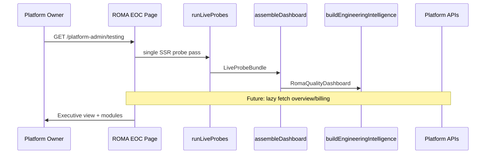

# ROMA Platform Architecture

**Program:** ROMA Platform Integration  
**Status:** Architecture design (analysis only)  
**Date:** 2026-07-07

Related: [ROMA_PLATFORM_INVENTORY.md](./ROMA_PLATFORM_INVENTORY.md) · [ROMA_PLATFORM_MODEL.md](./ROMA_PLATFORM_MODEL.md) · [ROMA_PLATFORM_INTEGRATION_ROADMAP.md](./ROMA_PLATFORM_INTEGRATION_ROADMAP.md)

---

## Vision

**ROMA Engineering Operations Center** is the single platform-owner surface for operational truth across AISTROYKA — replacing the "ROMA QA Center" framing without rewriting working modules.

```
Platform Owner
      ↓
Cloudflare Access (admin.aistroyka.ai)
      ↓
Supabase session + platform_owner_grants
      ↓
┌─────────────────────────────────────────────────────┐
│  ROMA Engineering Operations Center                  │
│  One navigation · One dashboard · One source of truth│
├─────────────────────────────────────────────────────┤
│  Executive View  │  Operations  │  Delivery  │  Apps │
└─────────────────────────────────────────────────────┘
      ↓ reads (no duplicate fetch layers)
┌──────────────┬──────────────┬──────────────┬──────────────┐
│ live probes  │ platform APIs│ intel engine │ audit history│
│ (existing)   │ (existing)   │ (existing)   │ (existing)   │
└──────────────┴──────────────┴──────────────┴──────────────┘
```

---

## Current State (Evidence)

| Layer | Location | Role |
|-------|----------|------|
| **UI shell** | `RomaQaCenterShell`, `PlatformAdminTestingClient` | Executive dashboard V3 |
| **Probe runner** | `roma-live-probes.ts` | 15-source read-only probes |
| **Dashboard assembly** | `roma-quality-dashboard.service.ts` | Components, domains, coverage |
| **Intelligence** | `roma-engineering-intelligence.ts` | Release/confidence rules |
| **Safe audit** | `roma-safe-readonly-audit.ts` | Manual refresh + snapshot |
| **Run history** | `roma-run-history.service.ts` | Saved snapshots |
| **Quality modules** | graph, catalog, change intel, planner, engine | Read-only analysis |
| **Platform shell (outside ROMA)** | `/platform-admin`, billing, leads | Separate nav items |

**Gap:** Platform shell and ROMA are **two navigation contexts** — not yet one Engineering Operations Center.

---

## Target Architecture (Integration Program)

### Principle: Integrate, Don't Rewrite

| Keep unchanged | Integrate into ROMA view |
|----------------|--------------------------|
| `runLiveProbes()` | Platform overview KPIs via existing APIs |
| Security gates | Shell nav unification under ROMA |
| Safe audit / history | Billing pilot status surface |
| Execution policy (disabled) | Leads/support ticket counts |
| Engineering intelligence | Mobile CI/store signals (when available) |

### Layer Model

```
┌─────────────────────────────────────────╗
║ L4  Executive View (design — Phase 4)   ║  ← category rollups, no new logic
╠═════════════════════════════════════════╣
║ L3  Platform Registry (Phase 2 impl)    ║  ← metadata only
╠═════════════════════════════════════════╣
║ L2  Existing Services (no rewrite)        ║
║     probes · dashboard · intel · APIs   ║
╠═════════════════════════════════════════╣
║ L1  Production Subsystems (22 inventoried)║
╚═════════════════════════════════════════╝
```

---

## Data Flow (Canonical)



**Rule:** One probe pass per dashboard SSR (already implemented). Platform API calls are **additive lazy sections** — not a second probe loop.

---

## Navigation Architecture (Target)

Current platform-admin shell (`shell-nav.ts`):

| Item | Today | Target EOC |
|------|-------|------------|
| Overview | `/platform-admin` | **Merged** into ROMA executive home or linked section |
| Billing pilot | `/platform-admin/billing` | **Business** section deep-link |
| Contact leads | `/platform-admin/leads` | **Business** section deep-link |
| ROMA QA Center | `/platform-admin/testing` | **Renamed** → Engineering Operations Center (copy only, later) |

**Phase constraint:** This program document defines integration; **UI rename/redesign is out of scope** until a dedicated UX phase with explicit approval.

---

## Security Architecture (Unchanged)

Defense in depth preserved:

1. Cloudflare Access on `admin.aistroyka.ai`
2. Supabase authenticated session
3. `platform_owner_grants` (not tenant admin)
4. `requirePlatformOwnerApi` on `/api/v1/platform/*`
5. RLS + service-role only for audit run persistence

Integration program **must not** weaken any layer or expose tenant financial internals on owner surfaces.

---

## Module Boundaries

| Module | Boundary |
|--------|----------|
| ROMA probes | Read-only, fail-closed, no mutations |
| Safe audit | Explicit owner refresh + save only |
| Execution engine | Policy evaluation only — execution disabled |
| Platform APIs | Owner-tiered read/write |
| Tenant dashboard | Out of scope — tenant RLS isolated |
| Customer/owner portal | Out of scope — stakeholder surfaces separate |

---

## Executive View Model (Design Reference)

See [ROMA_PLATFORM_MODEL.md](./ROMA_PLATFORM_MODEL.md) category rollups and Phase 4 section below in gap/roadmap docs.

Planned executive sections (reference existing services only):

| Section | Existing service sources |
|---------|-------------------------|
| **Platform** | `buildPlatformHealthCards`, platform registry |
| **Applications** | Web components + mobile metadata probe |
| **Infrastructure** | system health, supabase, storage, notifications |
| **Data** | DB + storage + migrations probes |
| **AI** | ai probe + engineering intelligence |
| **Security** | release env, audit log, security domain |
| **Delivery** | git metadata, cloudflare, release intelligence |
| **Business** | `/platform/overview`, billing diagnostics |

---

## Anti-Patterns (Explicitly Forbidden)

- Second health polling loop on client
- Duplicating `validateReleaseEnv()` in registry
- Fabricating mobile/store health without CI/store evidence
- Merging tenant admin (`/admin`) into ROMA
- Auto-execution from integration work
- New public APIs for subsystem health

---

## Documentation Hierarchy

| Doc | Role |
|-----|------|
| `docs/platform/ROMA_PLATFORM_INVENTORY.md` | Subsystem truth |
| `docs/platform/ROMA_PLATFORM_MODEL.md` | Metadata registry design |
| `docs/platform/ROMA_PLATFORM_GAP_ANALYSIS.md` | Gaps + priorities |
| `docs/platform/ROMA_PLATFORM_INTEGRATION_ROADMAP.md` | Phased delivery |
| `docs/audits/ROMA_DOCUMENTATION_INDEX.md` | Runtime ROMA module docs |

---

## Verdict

Architecture for platform integration is **additive and service-reuse-first**. No rewrite required to begin Phase 2 registry implementation.
