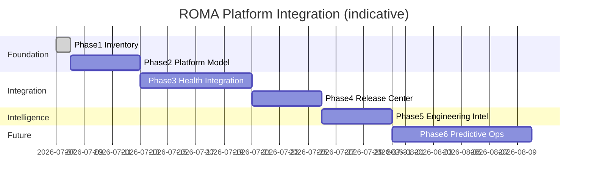

# ROMA Platform Integration Roadmap

**Program:** ROMA Platform Integration  
**Phase:** 6 — implementation roadmap (design only)  
**Date:** 2026-07-07  
**Constraint:** Each phase independently deployable. **No execution, no AI expansion, no security weakening.**

Related: [ROMA_PLATFORM_GAP_ANALYSIS.md](./ROMA_PLATFORM_GAP_ANALYSIS.md) · [ROMA_PLATFORM_ARCHITECTURE.md](./ROMA_PLATFORM_ARCHITECTURE.md)

---

## Program Goal

Transform ROMA from **QA Center** into **Engineering Operations Center** — one dashboard, one navigation, one source of truth for the platform owner — by **integrating existing capabilities**, not rewriting them.

---

## Roadmap Overview

**Total estimated effort (Phases 2–5):** **~4–5 engineering weeks** (1 senior engineer, docs + tests included).  
**Phase 6:** research spike — not scheduled for immediate delivery.

---

## Phase 1 — Platform Inventory ✅

**Status:** **COMPLETE** (this program)

**Deliverables:**
- [x] `docs/platform/ROMA_PLATFORM_INVENTORY.md`
- [x] Data source audit (in gap analysis)
- [x] 22 subsystems documented with UNKNOWN where applicable

**Exit criteria:** Inventory reviewed by platform owner; no fabricated health.

---

## Phase 2 — Unified Platform Model

**Goal:** Codify `ROMA_PLATFORM_MODEL.md` as `roma-platform-registry.ts` (metadata only).

| Task | Effort | Deployable alone? |
|------|--------|-------------------|
| Create registry TS module from 22 subsystems | 1d | Yes — unused by UI initially |
| Add `resolveSubsystemState()` pure helper | 1d | Yes |
| Unit tests for registry completeness | 0.5d | Yes |
| Dedupe documentation links in registry | 0.5d | Yes |
| Wire registry labels into dashboard (read-only) | 1d | Yes — copy/ownership display only |

**Dependencies:** Phase 1  
**Risk:** Low — no I/O changes  
**Exit criteria:** Registry tests pass; dashboard can display subsystem owner/doc links without new probes.

---

## Phase 3 — Platform Health Integration

**Goal:** Single-pane health using **existing probes + platform APIs** — no second probe runner.

| Task | Effort | Priority |
|------|--------|----------|
| Consolidate duplicate DB/build stamp derivation | 1d | High |
| Lazy-fetch `/platform/overview` for Business section | 1d | Critical |
| Surface billing pilot summary via existing billing APIs | 1d | High |
| Add support/leads counts (read-only owner APIs) | 1d | Medium |
| Ingest mobile CI smoke status file (when artifact exists) | 2d | High |
| Mark UNKNOWN explicitly for mobile without CI evidence | 0.5d | Critical |
| Optional: CF Access audit JSON ingestion (manual upload) | 1d | Medium |

**Dependencies:** Phase 2 registry for labeling  
**Exit criteria:** Executive dashboard shows platform ops KPIs; mobile shows UNKNOWN or CI evidence — never fabricated store health.

---

## Phase 4 — Release Center

**Goal:** Unify delivery signals already partially in ROMA.

| Task | Effort |
|------|--------|
| Canonical `deployIdentity` object (SHA, env, branch, external stamp) | 1d |
| Release blockers panel sources documented + linked to registry | 0.5d |
| Staging vs production SHA comparison (existing drift rule) | 0.5d |
| GitHub Actions run link when env present | 1d |
| Safe audit snapshot linked as release evidence artifact | 0.5d |

**Dependencies:** Phase 3 health consolidation  
**Exit criteria:** Owner can answer "what is deployed?" and "what blocks release?" from one ROMA view.

---

## Phase 5 — Engineering Intelligence Integration

**Goal:** Intelligence consumes **platform registry + integrated health** — no new rule engine fork.

| Task | Effort |
|------|--------|
| Map intelligence blind spots to registry gaps | 1d |
| Add subsystem-scoped recommendations from registry UNKNOWN states | 1d |
| Wire platform-operations KPIs into business impact section | 1d |
| Extend golden path E2E to CI (optional workflow_dispatch) | 1d |
| Recertification pass | 1d |

**Dependencies:** Phases 3–4  
**Exit criteria:** ROMA recertification ≥ 8.5; `READY_FOR_RECERTIFICATION` YES.

---

## Phase 6 — Predictive Operations (Future)

**Research only — not in current program scope.**

| Capability | Prerequisite |
|------------|--------------|
| Trend analysis on audit run history | Retention + compare UI |
| Anomaly hints on probe deltas | Historical probe store (new table — **future gated**) |
| Recurring issue fingerprints | Run history Phase 2+ features |

**Explicitly excluded until:** Phases 2–5 closed with post-audit YES.

---

## Navigation Integration (Cross-Cutting)

Recommended sequence **within Phase 3**:

1. Add registry-driven "Platform" section to existing ROMA nav (no redesign)
2. Deep-link shell pages (billing, leads, overview) from ROMA Business section
3. Rename shell label "ROMA QA Center" → "Engineering Operations" (copy/i18n only — owner-approved)

**No route deletion** in integration program — preserve `/platform-admin/billing` etc.

---

## Executive View Model (Phase 4 Design — Not Implemented)

| Section | Subsystems | Existing services |
|---------|------------|-------------------|
| **Platform** | web-platform-admin, backend-api, platform-operations | overview API, health cards |
| **Applications** | web-public, web-dashboard, ios-*, android-* | components + mobile probe |
| **Infrastructure** | backend-system-health, notifications, cloudflare-edge | system health, notification config |
| **Data** | supabase-database, supabase-storage | DB + storage probes |
| **AI** | ai-runtime | ai probe + intelligence |
| **Security** | security-platform, security-tenant-isolation, cloudflare-access, supabase-auth | release env, audit log |
| **Delivery** | release-pipeline, cloudflare-edge | git + CF probes |
| **Business** | billing, platform-operations, integrations-external | billing APIs, overview |

---

## Independent Deployability Matrix

| Phase | Can ship without next phase? | User-visible change |
|-------|------------------------------|---------------------|
| 1 | ✅ Done | Docs only |
| 2 | ✅ | Owner/doc metadata (optional UI) |
| 3 | ✅ | KPIs + honest UNKNOWN states |
| 4 | ✅ | Release clarity improvements |
| 5 | ✅ | Richer intelligence + CI golden path |
| 6 | N/A | Future |

---

## Success Metrics

| Metric | Target after Phase 5 |
|--------|---------------------|
| Subsystems with honest state in ROMA | 22/22 (UNKNOWN allowed) |
| Platform API groups integrated | ≥ 4/5 |
| Duplicate probe derivations | 0 |
| Owner golden path in CI | Optional workflow_dispatch green |
| Certification score | ≥ 8.5 / 10 |
| ENTERPRISE_READY | Evaluate in recertification |

---

## Recommended Implementation Order

1. **Phase 2** — Registry (foundation, zero runtime risk)
2. **Phase 3** — Platform overview + dedupe probes (highest owner value)
3. **Phase 4** — Release center consolidation
4. **Phase 5** — Intelligence + recertification
5. **Phase 6** — Defer until explicit product approval

---

## Verdict

| Flag | Value |
|------|-------|
| Roadmap defined | **YES** |
| Phases independently deployable | **YES** |
| **READY_FOR_PLATFORM_INTEGRATION** | **YES** (Phase 2 implementation may begin) |
