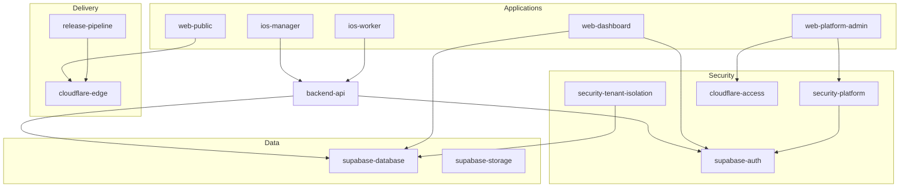

# ROMA Platform Model

**Program:** ROMA Platform Integration  
**Status:** Phase 3 — canonical metadata model (design only)  
**Date:** 2026-07-07  
**Rule:** Metadata registry only. **No health logic duplication.** Health resolution stays in `roma-live-probes.ts` + existing services.

Related: [ROMA_PLATFORM_INVENTORY.md](./ROMA_PLATFORM_INVENTORY.md) · [ROMA_PLATFORM_ARCHITECTURE.md](./ROMA_PLATFORM_ARCHITECTURE.md)

---

## Purpose

Define **one canonical platform model** that ROMA Engineering Operations Center will reference. Each subsystem entry describes **what exists**, **who owns it**, **where health comes from**, and **what depends on it** — not how to compute health.

Implementation (future phase) should be a **read-only registry file** (e.g. `roma-platform-registry.ts`) consumed by dashboard assembly — **not** a second probe runner.

---

## Core Types (Design)

```typescript
/** How ROMA resolves operational state for a subsystem. */
type RomaHealthSourceKind =
  | "live_probe"           // roma-live-probes.ts probe ID
  | "dashboard_component"  // roma-quality-dashboard systemComponents id
  | "platform_api"         // GET /api/v1/platform/* (owner-gated)
  | "external_manual"      // Human/scheduled audit; no auto health
  | "unknown";             // No evidence — display UNKNOWN

type RomaPlatformCategory =
  | "applications"
  | "infrastructure"
  | "data"
  | "ai"
  | "security"
  | "delivery"
  | "business"
  | "integrations";

type RomaRiskLevel = "critical" | "high" | "medium" | "low";

type RomaPlatformSubsystem = {
  id: string;
  displayName: string;
  category: RomaPlatformCategory;
  healthSource: {
    kind: RomaHealthSourceKind;
    ref: string;              // probe id, component id, or API path
    fallbackDisplay: "unknown" | "not_configured";
  };
  dependencies: readonly string[];  // other subsystem ids
  riskLevel: RomaRiskLevel;
  releaseCritical: boolean;
  owner: string;
  documentation: readonly string[];   // repo-relative paths
  notes?: string;
};
```

---

## Health Resolution Contract

1. **Single probe pass:** `runLiveProbes()` remains the only automated live fetch orchestrator.
2. **Registry lookup:** Subsystem `healthSource.ref` maps to probe output or dashboard component — no new fetch in registry.
3. **Platform APIs:** Subsystems with `platform_api` source are **on-demand** (owner session), not SSR probe loop — avoids duplicate DB hits until explicitly wired.
4. **UNKNOWN:** If `healthSource.kind === "unknown"` or probe `connected === false`, UI shows **Unknown** — never green by default.
5. **No fabrication:** Registry must not contain default `"healthy"` status fields.

---

## Canonical Subsystem Registry

| id | displayName | category | healthSource | releaseCritical | owner |
|----|-------------|----------|--------------|-----------------|-------|
| `web-public` | Public Website | applications | `live_probe:core_health` | yes | Web |
| `web-dashboard` | Web Dashboard | applications | `dashboard_component:web_dashboard` | yes | Web |
| `web-platform-admin` | Platform Admin Shell | applications | `platform_api:/platform/health` | yes | Platform |
| `backend-api` | Backend API | infrastructure | `live_probe:core_health` | yes | Backend |
| `backend-system-health` | System Health Service | infrastructure | `live_probe:system_health` | yes | Backend |
| `supabase-database` | Supabase Database | data | `live_probe:supabase_db` + `db_migrations` | yes | Data |
| `supabase-auth` | Authentication | security | `dashboard_component:authentication` | yes | Identity |
| `supabase-storage` | Object Storage | data | `live_probe:supabase_storage` | high | Data |
| `cloudflare-edge` | Cloudflare Edge | delivery | `live_probe:cloudflare_deploy` | yes | Release |
| `cloudflare-access` | Cloudflare Access | security | `external_manual:PLATFORM_ADMIN_OWNER_ONLY_ACCESS_REPORT` | yes | Security |
| `ai-runtime` | AI Runtime | ai | `live_probe:ai_configuration` | medium | AI |
| `notifications` | Push & Notifications | infrastructure | `live_probe:notification_config` | medium | Mobile/Platform |
| `billing` | Billing & Entitlements | business | `live_probe:billing_diagnostics` | high | Platform Finance |
| `ios-manager` | iOS Manager | applications | `live_probe:mobile_metadata` | high | Mobile iOS |
| `ios-worker` | iOS Worker | applications | `live_probe:mobile_metadata` | high | Mobile iOS |
| `android-manager` | Android Manager | applications | `live_probe:mobile_metadata` | low | Mobile Android |
| `android-worker` | Android Worker | applications | `live_probe:mobile_metadata` | low | Mobile Android |
| `release-pipeline` | Release Pipeline | delivery | `live_probe:git_metadata` + `github_actions_env` | yes | Release |
| `security-platform` | Platform Security | security | `live_probe:release_env` + `platform_audit_log` | yes | Security |
| `security-tenant-isolation` | Tenant Isolation | security | `unknown` | yes | Security |
| `integrations-external` | External Integrations | integrations | `live_probe:billing_diagnostics` (partial) | medium | Integrations |
| `platform-operations` | Support & Tenants | business | `platform_api:/platform/overview` | medium | Platform Ops |

---

## Dependency Graph (High Level)



---

## Mapping: Registry → Existing Services

| Registry field | Existing implementation |
|----------------|-------------------------|
| Live probes | `apps/web/lib/platform-admin/roma-live-probes.ts` |
| Dashboard components | `roma-quality-dashboard.service.ts` → `buildSystemComponents()` |
| Engineering intelligence | `roma-engineering-intelligence.ts` |
| Platform APIs | `apps/web/app/api/v1/platform/*` |
| Owner gate | `requirePlatformOwnerApi`, `gateOwnerRequest` |
| Mobile reality docs | `docs/release-hardening/MOBILE_PILOT_READINESS.md` |
| Security docs | `docs/security/PLATFORM_ADMIN_OWNER_ONLY_ACCESS_REPORT.md` |

---

## Category Rollups (For Executive View)

| Category | Subsystem count | Primary health driver |
|----------|-----------------|----------------------|
| applications | 6 | Mixed — web probes + mobile UNKNOWN |
| infrastructure | 4 | Live probes |
| data | 2 | Supabase probes |
| ai | 1 | Config probe |
| security | 3 | Release env + manual Access |
| delivery | 2 | Git/CF probes |
| business | 2 | Platform APIs (unwired) |
| integrations | 1 | Billing partial |

---

## Non-Goals (This Model)

- Does **not** replace `RomaQualityGraph` product-area nodes
- Does **not** add execution or automation triggers
- Does **not** expose tenant business data to ROMA without owner API gates
- Does **not** duplicate `buildRomaEngineeringIntelligence()` rules — intelligence **consumes** resolved subsystem states

---

## Future Implementation Notes

1. Add `roma-platform-registry.ts` as pure metadata (this document → code).
2. Add `resolveSubsystemState(registry, probeBundle, components)` — pure function, no I/O.
3. Dashboard reads registry for labels/ownership; probes unchanged.
4. Platform API subsystems fetched lazily on executive dashboard sections marked `business` / `platform-operations`.

---

## Verdict

| Item | Status |
|------|--------|
| Canonical model defined | **YES** |
| Health logic duplicated | **NO** |
| Ready for Phase 3 implementation | **YES** (after roadmap Phase 2) |
