# AISTROYKA Completion Delivery Roadmap

> **Publish note (2026-08-09):** Previously local/unpublished historical delivery plan from the Phase 8 / Product Design program worktree (`release/phase8-ops-2026-08-02`, untracked). Published so the 2026-08-09 Product Design audit pack is self-contained. Does **not** mark Wave C or **Product Design Remediation Slice 01** complete. Historical **Liquid Glass Slice 1** (public foundation) is a separate, already-implemented track.


**Дата:** 2026-08-02  
**Статус:** ACTIVE  
**Цель:** довести AISTROYKA от восстановленной Phase 8 до доказанного запуска первого клиента и финального Phase 10 closure.  
**Базовый аудит:** `docs/audit/AISTROYKA_FULL_PRODUCT_DESIGN_ARCHITECTURE_AUDIT_2026-08-02.md`  
**Стратегические ограничения:** `docs/roadmap/AISTROYKA_MEGA_ROADMAP_CUSTOMER_FINANCE_SAFE.md`  
**Предыдущий план:** `docs/roadmap/AISTROYKA_100_PERCENT_COMPLETION_PLAN.md` *(unavailable on canonical `main` / this publish pack — local/unpublished historical reference; mega-roadmap remains authoritative)*

---

## 1. Целевой результат

Roadmap закрывает три последовательных результата:

1. **Controlled web + iOS pilot GO** — реальный клиент может пройти Day 0 и основные Worker/Manager/Portal flows.
2. **Production launch readiness** — legal, localization, дизайн, observability и live-provider claims доказаны.
3. **Final 100 closure** — актуальные документы не противоречат runtime, открытые пункты явно разделены на launch scope и post-pilot backlog.

100% здесь означает не отсутствие будущих дефектов, а выполнение всех согласованных gates с воспроизводимыми доказательствами и без известных локальных блокеров.

---

## 2. Текущая точка старта

| Контур | Стартовый статус 2026-08-02 |
|---|---|
| Production | Восстановлен на `8408ca2`; health, DB, release stamp и rate-limit RPC зелёные |
| Operations | Phase 8 release path = YES; новый 72h observation window идёт до 2026-08-05 12:35:15Z |
| Web/API | Сборки проходят; 2737 тестов PASS; 22 production-build warnings остаются |
| Design | Wave A/B complete; Wave C in progress |
| Localization | Key parity PASS, semantic translation и hardcoded English не закрыты |
| Legal | Privacy/Terms содержат placeholder content |
| AI | Configured, но `configured_unverified`; свежего live-provider proof нет |
| Push | APNS/FCM код и contracts есть; live delivery proof нет |
| iOS | Manager/Worker simulator build PASS; physical device и TestFlight открыты |
| Android | Build PASS; официально deferred для первого пилота |
| Pilot | Phase 9 NO; актуальный Day‑0 evidence pack не закрыт |
| Final closure | Phase 10 не начата |

---

## 3. Неподвижные правила выполнения

Каждый этап выполняется только по циклу:

`audit → scoped implementation → validation → repair → validation → closure verdict`

Правила:

1. Одновременно активен один этап критического пути.
2. Следующий этап не начинается, пока текущий не получил `YES`.
3. Внешний блокер фиксируется как `BLOCKED_EXTERNAL` с точным недостающим входом.
4. Будущие checkpoints и результаты не создаются заранее.
5. Production deploy, DB migration, store upload, live push, paid AI request или billing mutation выполняются только по отдельному явному authorization gate.
6. Dirty worktree и пользовательские изменения сохраняются.
7. Исторические отчёты не переписываются; новая правда оформляется отдельным current/closure artifact.
8. Customer/stakeholder surfaces не получают internal contractor finance.
9. iOS остаётся основным мобильным контуром первого пилота.
10. Android не расширяется без явного owner/client mandate.

---

## 4. Критический путь

```mermaid
flowchart LR
  R0["R0 Release truth + 72h stabilization"] --> R1["R1 Legal + semantic localization"]
  R1 --> R2["R2 Web reliability + warning zero"]
  R2 --> R3["R3 Design Wave C pilot surfaces"]
  R3 --> R4["R4 Live AI / push / billing certification"]
  R4 --> R5["R5 iOS device + TestFlight"]
  R5 --> R6["R6 Phase 9 Client Day 0"]
  R6 --> R7["R7 Controlled pilot observation"]
  R7 --> R8["R8 Phase 10 final closure"]
  R8 --> R9["R9 Post-pilot Android / SCIM / scale"]
```



### Оценка длительности

| Этап | Оценка | Зависит от внешних участников |
|---|---:|---|
| R0.1–R0.2 | 1–3 календарных дня | 72h clock / Cloudflare stability |
| R0.3 | 1–3 рабочих дня после stabilization | Canonical source convergence + protected landing |
| R1 | 2–4 рабочих дня | Утверждённый legal copy |
| R2 | 2–3 рабочих дня | Нет |
| R3 | 4–7 рабочих дней | Design/QA review |
| R4 | 2–4 рабочих дня | AI/APNS/Stripe credentials и authorization |
| R5 | 2–5 рабочих дней | Apple signing, TestFlight, физические iPhone |
| R6 | 1–2 рабочих дня | Client intake и sign-offs |
| R7 | 7–14 календарных дней | Реальная активность пилота |
| R8 | 1–2 рабочих дня | Все предыдущие verdicts = YES |
| R9 | Отдельный roadmap | Android/Enterprise/scale business mandate |

Оценки не являются обещанием даты. Внешний blocker останавливает соответствующий gate, но не маскируется локальным PASS.

---

## 5. Детальный roadmap

## R0 — Release truth и завершение Phase 8 stabilization

**Приоритет:** P0  
**Цель:** получить один непротиворечивый current release truth и закрыть новый 72h observation window после Workers Builds P1.

### R0.1 — Current truth reconciliation — первый шаг

Задачи:

- зафиксировать branch/HEAD/origin-main divergence и dirty-worktree boundaries;
- повторно проверить apex/www/staging health, build stamp, DB, RPC и AI operational claim;
- повторно проверить public locales, guest redirects и security headers;
- сопоставить `STATUS.md`, `docs/CURRENT_PROJECT_TRUTH_INDEX.md`, Phase 8 release/closure docs и `FIRST_72H_OPERATIONS_CHECKLIST.md`;
- создать отдельный current release truth artifact;
- обновить truth index и STATUS без переписывания исторических evidence snapshots;
- отметить все старые противоречивые verdicts как historical/superseded ссылками.

Exit gate R0.1:

- один документ содержит текущие SHA, runtime facts, phase verdicts и открытые gates;
- truth index больше не заявляет устаревший main/runtime как current;
- нет созданных заранее T+6h/T+72 evidence;
- никаких code/runtime/deploy mutations;
- verdict `YES` для reconciliation, даже если observation window ещё `IN_PROGRESS`.

**Current R0.1 artifact:** `docs/reconciliation/release-truth-2026-08-02/01_CURRENT_RELEASE_TRUTH.md`.

### R0.2 — 72h stabilization closure

Задачи:

- выполнить только наступившие checkpoints;
- доказать отсутствие повторной самопроизвольной activation/deploy drift;
- проверить apex/www/staging SHA и release stamp;
- проверить security headers consecutive policy;
- подтвердить containment Workers Builds или явно зафиксировать недоступность API как внешний операционный blocker;
- закрыть incident summary и Phase 8 stabilization verdict.

Exit gate R0.2:

- observation window полностью истёк;
- все обязательные checkpoints PASS;
- runtime SHA не дрейфовал;
- Phase 8 stabilization = `YES`;
- `Safe to proceed to R0.3 = YES`;
- `Safe to proceed to R1 = NO` до canonical source convergence.

**R0.1 Cursor prompt (completed):** `docs/ops/CURSOR_STEP_01_RELEASE_TRUTH_AND_STABILIZATION_PROMPT_2026-08-02.md`.

**R0.2 Cursor prompt:** `docs/ops/CURSOR_STEP_02_PHASE8_STABILIZATION_PROMPT_2026-08-02.md`.

**R0.2 signal policy:** `docs/ops/PHASE8_STABILIZATION_SIGNAL_THRESHOLDS_2026-08-02.md`.

**R0.2 status (current):** **IN_PROGRESS** — T+6h + **T+24h PASS** (LATE_OBSERVATION) evidence `docs/roadmap/evidence/phase8-stabilization-t24h-2026-08-03.json`; log `docs/reconciliation/release-truth-2026-08-02/02_R0_2_STABILIZATION_LOG.md`; next **T+48h** `2026-08-04T12:35:15Z`. Safe to proceed to R0.3/R1 = **NO**.

**Autonomous orchestrator:** `docs/ops/CURSOR_AUTONOMOUS_COMPLETION_ORCHESTRATOR_PROMPT_2026-08-02.md`.

**R0.2 resume prompt:** `docs/ops/CURSOR_RESUME_R0_2_AUTONOMOUS_PROMPT_2026-08-04.md`.

### R0.3 — Canonical source convergence

**Причина:** deployed SHA `8408ca26…` не входит в текущий `origin/main`, а release-ветка расходится с main. Кодовые R1+ изменения нельзя безопасно начинать на неоднозначной линии.

Задачи:

- построить commit/file matrix release branch ↔ `origin/main` ↔ deployed SHA;
- отделить runtime/hardening changes от исторических docs, generated evidence, credentials и unrelated work;
- подготовить минимальные coherent slices на чистой ветке/worktree от `origin/main`;
- не делать broad merge всех release commits;
- выполнить полный local validation;
- провести изменения через protected PR path, current-head CI и non-author approval;
- сохранить различие между canonical source SHA и deployed runtime SHA до отдельного доказанного deploy.

Exit gate R0.3:

- canonical `origin/main` содержит утверждённую source convergence;
- protected merge и CI доказаны;
- секреты/generated evidence не попали в source line;
- создан чистый воспроизводимый feature base;
- `Safe to proceed to R1 = YES`.

Без commit/push/reviewer authorization допустимы audit, slice plan, local patch и validation, но verdict остаётся `BLOCKED_EXTERNAL_PROTECTED_LANDING`.

**Autonomous orchestrator:** `docs/ops/CURSOR_AUTONOMOUS_COMPLETION_ORCHESTRATOR_PROMPT_2026-08-02.md`.

---

## R1 — Legal и semantic localization

**Приоритет:** P0  
**Цель:** убрать публичные заглушки и смешение языков на launch surfaces.

**Prepared Cursor prompt (entry-gated by R0.2 YES + R0.3 YES):** `docs/ops/CURSOR_STEP_03_LEGAL_AND_SEMANTIC_LOCALIZATION_PROMPT_2026-08-02.md`.

Задачи:

- получить утверждённые Privacy Policy и Terms of Service;
- заменить legal placeholders для EN/RU/ES/IT;
- исправить английский `Continue exploring` блок на RU/ES/IT;
- убрать hardcoded user-facing English из tenant admin, platform admin, operator и support;
- добавить semantic i18n audit, отличающий допустимые brand/technical terms от непереведённого copy;
- проверить overflow/wrapping после перевода;
- проверить locale switching и translated error states.

Required checks:

- `bun run i18n:check`;
- `I18N_CHECK_ALL=1 bun run i18n:check`;
- semantic untranslated-string check;
- scoped public/admin screenshots EN/RU/ES/IT;
- `bun run lint`;
- `bun run test`;
- `bun run cf:build`.

Exit gate:

- legal placeholders = 0;
- подтверждённые непереведённые launch strings = 0;
- launch pages визуально проходят 4 locales;
- legal approval recorded;
- `Safe to proceed to R2 = YES`.

---

## R2 — Web reliability и clean production build

**Приоритет:** P0/P1  
**Цель:** убрать скрытые runtime/UI риски и сделать зелёный gate честным.

Задачи:

- закрыть 22 React Hook/Next Image warnings в 20 файлах;
- убрать `--quiet` как способ скрытия warnings или ввести отдельный `lint:warnings-zero` gate;
- проверить pagination/filter/locale dependencies в devices, uploads, reports, leads, jobs, push и AI;
- добавить targeted regression tests для исправленных hooks;
- заменить два `` либо документировать обоснованный custom loader;
- обновить Browserslist data;
- поднять Cloudflare compatibility date после безопасной проверки;
- инвентаризировать Gradle 9 deprecations без расширения Android scope;
- расширить direct route tests для P0 write/finance/admin handlers, где нет shared-contract proof.

Required checks:

- `bun install --frozen-lockfile`;
- `node scripts/ci/validate-npm-lock.cjs`;
- `bun run lint` с zero-warning policy;
- `bunx --cwd apps/web tsc --noEmit`;
- `bun run test`;
- `bun run build`;
- затем, не параллельно, `bun run cf:build`.

Exit gate:

- production build warnings = 0 либо каждый исключённый warning имеет тест и письменное обоснование;
- P0 changed flows имеют regression tests;
- build/cf-build PASS;
- `Safe to proceed to R3 = YES`.

---

## R3 — Design Wave C для pilot-critical surfaces

**Приоритет:** P1 с P0 launch surfaces  
**Цель:** закончить не весь декоративный long tail, а реальные критические journeys.

Web scope:

- public home/auth;
- dashboard/project detail;
- reports/approvals/change orders/defects/handover;
- portal commercial decisions;
- admin/operator/platform admin;
- loading/empty/error/permission-denied/offline states.

iOS scope:

- Worker login → project/task → photo/comment/voice-note → submit → retry/resubmit;
- Manager login → report review → approve/reject → task/navigation;
- Dynamic Type, keyboard, safe areas и offline/retry states.

Tasks:

- удалить оставшиеся legacy token aliases из active components;
- использовать canonical web/mobile brand tokens;
- построить actual-screen visual matrix отдельно от `DesignPreview` harness;
- добавить responsive and accessibility screenshots/tests;
- проверить contrast, focus, touch targets, large text и reduced motion;
- закрыть Wave C P0/P1 backlog отдельным closure artifact.

Exit gate:

- critical surfaces используют semantic tokens;
- actual-screen matrix покрывает primary/loading/empty/error/denied;
- accessibility blockers отсутствуют;
- DesignPreview evidence не используется как product-readiness proof;
- `Safe to proceed to R4 = YES`.

---

## R4 — Live-provider certification

**Приоритет:** P0 для включённых в пилот функций  
**Цель:** доказать внешние контуры либо честно выключить/маркировать их.

### AI

- выполнить canonical `scripts/smoke/ai_live_provider.sh --require-live`;
- доказать non-fallback response;
- записать `aiLastVerifiedSuccessAt` или эквивалентное runtime evidence;
- проверить UI labels для LIVE/DEGRADED/BETA.

### Push

- APNS delivery на pilot iPhone;
- token registration/rotation/unregister;
- tap navigation в Worker и Manager;
- retry/dead-letter visibility;
- FCM не является launch blocker, пока Android deferred.

### Billing — только если входит в pilot scope

- test checkout;
- signed webhook;
- idempotency;
- entitlement/reconciliation;
- customer-finance boundary;
- rollback/failure states.

Exit gate:

- каждый включённый provider имеет свежий live proof;
- непроверенные функции выключены или явно degraded;
- секреты/токены не попали в evidence;
- `Safe to proceed to R5 = YES`.

---

## R5 — iOS physical device и TestFlight

**Приоритет:** P0  
**Источник pilot release candidate:** `release/mobile-pilot-rc`, а не случайный `main` или design branch.

Задачи:

- подтвердить, что mobile RC содержит staging-proven web/API contract;
- собрать Worker и Manager archive;
- проверить archive metadata, signing, icons и orientation requirements;
- выполнить owner-gated TestFlight upload;
- пройти реальные iPhone flows Worker и Manager;
- проверить camera/media, background upload, offline/online recovery и APNS;
- включить PII-safe crash reporting;
- оформить device matrix и device-smoke evidence.

Exit gate:

- обе TestFlight builds VALID и соответствуют проверенному SHA;
- Worker и Manager device critical flows PASS;
- crash/diagnostics ownership определён;
- unresolved device blocker = 0;
- `Safe to proceed to R6 = YES`.

---

## R6 — Phase 9: первый клиент Day 0

**Приоритет:** P0  
**Цель:** выполнить реальный запуск без выдуманных данных и несанкционированных production mutations.

Задачи:

- заполнить gitignored real client intake;
- подтвердить sponsor, contacts, start date, roles и iOS device count;
- owner-authorized tenant/project/account provisioning;
- invites и role verification;
- support email, SLA/escalation path и incident contacts;
- staging dress rehearsal;
- production Day‑0 smoke с реальными ролями;
- owner + client sponsor sign-off.

Exit gate:

- `PILOT_DAY0_GO_NO_GO = YES`;
- client intake READY;
- tenant/project/users/roles verified;
- device smoke PASS;
- support path active;
- owner и client sign-off получены;
- `Safe to proceed to R7 = YES`.

---

## R7 — Controlled pilot observation

**Приоритет:** P0 после Day 0  
**Цель:** доказать продукт на реальной эксплуатации, а не только в smoke tests.

Задачи:

- daily health/5xx/auth/upload/sync/AI/push review;
- funnel: login → task/report → submit → review → decision;
- defect triage P0/P1/P2;
- no silent data loss, duplicate writes или cross-tenant leakage;
- support response и client feedback log;
- P0 fix-forward через обычный protected path;
- pilot exit review через 7–14 календарных дней.

Exit gate:

- P0 = 0;
- согласованный P1 backlog не мешает основной работе;
- data integrity и tenant isolation подтверждены;
- client sponsor принимает pilot outcome;
- `Safe to proceed to R8 = YES`.

---

## R8 — Phase 10 final closure

**Приоритет:** P0 governance  
**Цель:** опубликовать единственный итоговый verdict.

Задачи:

- обновить `docs/CURRENT_PROJECT_TRUTH_INDEX.md`;
- обновить `STATUS.md` и release verdict;
- связать Phase 0–9 closure artifacts;
- пометить stale claims historical/superseded;
- отделить launch scope от post-pilot backlog;
- опубликовать `GO`, `CONDITIONAL GO` или точный `NO-GO`.

Exit gate:

- Phase 0–9 verdicts согласованы;
- runtime SHA и release docs совпадают;
- неизвестных launch blockers нет;
- Final 100 closure = `YES`.

---

## R9 — Post-pilot roadmap

Не блокирует первый web+iOS pilot.

Возможные tracks:

1. Android Worker/Manager device, FCM и Google Play readiness.
2. SCIM implementation для подтверждённого Enterprise demand.
3. Performance/Lighthouse budgets и heavy admin bundle optimization.
4. Full design long tail P2.
5. Billing/account cutover после обязательного shadow validation.
6. Scale, observability и support automation.

Каждый track открывается отдельным owner decision и отдельным roadmap.

---

## 6. Ответственность

| Роль | Ответственность |
|---|---|
| Product owner | Scope, legal approval, provider/store authorization, client GO/NO-GO |
| Engineering | Scoped fixes, tests, build evidence, tenant/finance safety |
| QA/Release operator | Checkpoints, E2E/device matrix, evidence hygiene, closure verdict |
| Design owner | Wave C acceptance, accessibility и localization visual review |
| Legal/content owner | Privacy/Terms и launch copy approval |
| Client sponsor | Intake, devices, operational acceptance и Day‑0 sign-off |

Одна роль может выполняться одним человеком, но каждый gate всё равно должен иметь явного ответственного.

---

## 7. Обязательный формат closure для каждого этапа

```text
Stage:
Baseline SHA / runtime SHA:
Verdict: YES | NO | BLOCKED_EXTERNAL | IN_PROGRESS
Scope completed:
Files changed:
Checks executed:
Failures found and repaired:
External evidence:
Remaining blockers:
Safe to proceed to next stage: YES | NO
Next stage:
```

---

## 8. Текущий исполняемый шаг

**R0.1 — Current truth reconciliation: YES**, закрыт `2026-08-02T14:10:25Z`.

Closure artifact:

`docs/reconciliation/release-truth-2026-08-02/01_CURRENT_RELEASE_TRUTH.md`

Текущий шаг: **R0.2 — 72h stabilization closure**.

Исполняемый Cursor prompt:

`docs/ops/CURSOR_STEP_02_PHASE8_STABILIZATION_PROMPT_2026-08-02.md`

Signal thresholds:

`docs/ops/PHASE8_STABILIZATION_SIGNAL_THRESHOLDS_2026-08-02.md`

- ближайший checkpoint: T+6h `2026-08-02T18:35:15Z`;
- до наступления времени checkpoint имеет статус `NOT_DUE`;
- T+72 window end: `2026-08-05T12:35:15Z`;
- Phase 8 stabilization: `IN_PROGRESS`;
- Phase 9: `NO`;
- Safe to proceed to R1: `NO`.

До полного завершения R0.2 не начинать legal, design, AI, mobile или feature implementation и не создавать будущие checkpoint evidence заранее.

Следующий промпт уже подготовлен, но закрыт входным gate:

`docs/ops/CURSOR_STEP_03_LEGAL_AND_SEMANTIC_LOCALIZATION_PROMPT_2026-08-02.md`

До R0.2 = YES и R0.3 = YES его единственный допустимый результат — `R1_GATE_CLOSED` без изменения файлов.

Единый автономный resumable prompt:

`docs/ops/CURSOR_AUTONOMOUS_COMPLETION_ORCHESTRATOR_PROMPT_2026-08-02.md`
